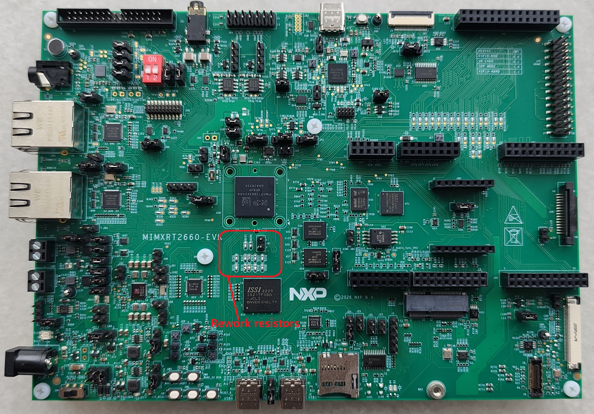

# eMMC Hardware Rework

## MIMXRT2660-EVK

The eMMC rework applies to the MIMXRT2660-EVK. Connect pins 1 and 3 of each of the following resistors:

- R268, R255, R256, R270, R257, R245, R246, R247, R267, R269, R248, R266

