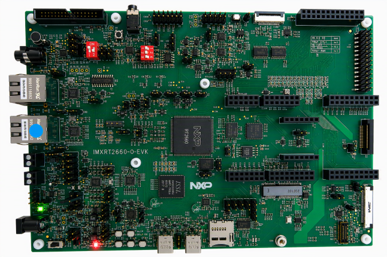

:pdf-download: ../../../_assets/boards/mimxrt2660evk/mcuxsdk-mimxrt2660evk.pdf

.. _mimxrt2660evk:

MIMXRT2660-EVK
####################

Overview
********

MCU device and part on board is shown below:

 - Device: MIMXRT2663
 - PartNumber: MIMXRT2663CVVAA

SDK Introduction
*******************

.. only:: html

   For an introduction to the MCUXpresso SDK, see :doc:`MCUXpresso Software Development Kit (SDK) </introduction/README>`.

.. only:: latex

   .. toctree::
      :maxdepth: 1

      /introduction/README

Getting Started with MCUXpresso SDK Package
*******************************************
.. toctree::
   :maxdepth: 1

   gettingStarted/repozip_gsindex.md

Getting Started with MCUXpresso SDK GitHub
*******************************************
.. toctree::
   :maxdepth: 1

   ../../../gsd/repo.rst

Release Notes
*******************************************
.. toctree::
   :maxdepth: 1

   releaseNotes/rnindex.md

ChangeLog
*******************************************
.. toctree::
   :maxdepth: 1

   changeLog/clindex.md

Driver API Reference Manual
****************************

This section provides a link to the Driver API RM, detailing available drivers and their usage to help you integrate hardware efficiently.

:ref:`MIMXRT2663_drivers`

Middleware Documentation
*****************************

Find links to detailed middleware documentation for key components. While not all onboard middleware is covered, this serves as a useful reference for configuration and development.

MCU Boot
========

:doc:`mcuboot_opensource<../../../middleware/mcuboot_opensource/README>`

eIQ
===

:ref:`eiq`

FreeMASTER
==========

:doc:`freemaster <../../../middleware/freemaster/doc/index>`

LVGL
====

:ref:`lvgl`

NXP Wi-Fi
=========

:ref:`wifi-bluetooth-802.15.4`

FreeRTOS
========

:ref:`freertos`

lwIP
====

:ref:`lwip`

USB
===

:ref:`usb`

FatFs
=====

:ref:`fatfs`

littlefs
========

:ref:`littlefs`

SD/MMC Card
===========

:ref:`sdmmc`

mbedTLS
=======

:ref:`middleware-mbedtls3x`
