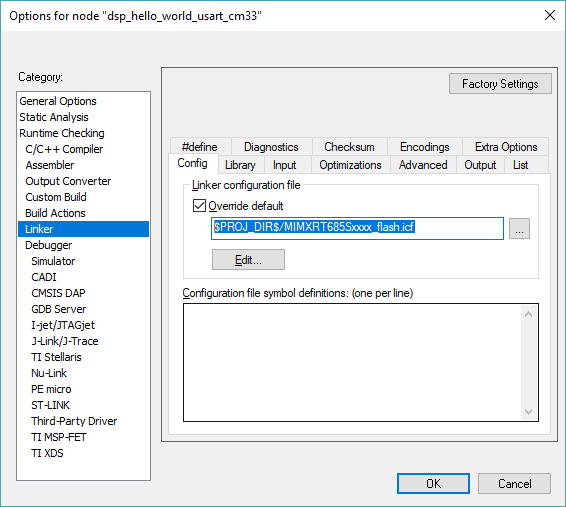
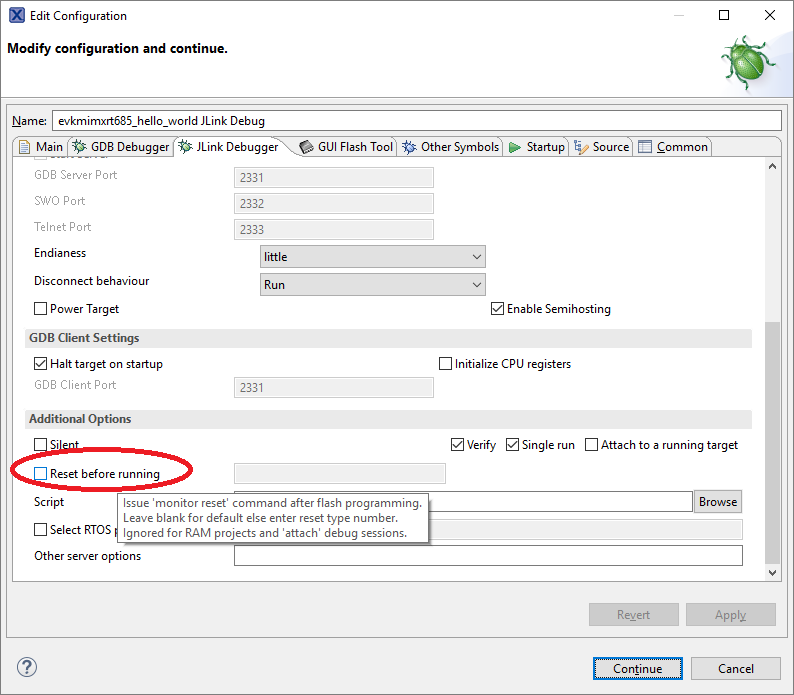

# Boot or Run from Flash

Boot from Flash is straight forward when using IAR environment. SDK provides either two or four different build configurations based on the project: debug \(from SRAM\)/ release \(from SRAM\)/ flash\_debug/ flash\_release. Flash configurations use different memory map in project linker options. For details, see [Figure 1](boot_or_run_from_flash.md#JFEFH).

|

|

To enable booting from flash, change the ISP mode/ SW5 switches on the EVK.

If using MCUXpresso/ armgcc build environment, note that by default build environment is set to boot from flash. Using MCUXpresso as an example:

1.  Make sure to use the latest version of MCUXpresso.
2.  Import the SDK examples.
3.  Once completed, double click the last file/ J-Link Debug.

    |

|

4.  Launch to modify J-Link debugger setting.
5.  Make sure to deselect **Reset before running**. This helps the flash-based program get into main function.

|

|

-   Make sure to:
    -   Modify DSP\_IMAGE\_COPY\_TO\_RAM and Define to 1 in **Project settings \> C/C++ General \> Paths and Symbols \> Symbols**.
    -   Have the right compilation flag as C/C++. Compilation flags do not work on \*.S files.
    -   Have \#define DSP\_IMAGE\_COPY\_TO\_RAM 1 as the first line of source/incbin.S to include the DSP binaries.
    -   Use the correct DSP binaries at correct path \(must be release binaries\).
    -   Provide the right image path to incbin.S.
-   To run/boot from flash, make sure that the board is set to FlexSPI flash boot mode \(ISP2: ISP1: ISP0 = ON, OFF, ON\).

**Parent topic:**[HiFi4 Boot Loader and Memory Map](../topics/hifi4_boot_loader_and_memory_map.md)

