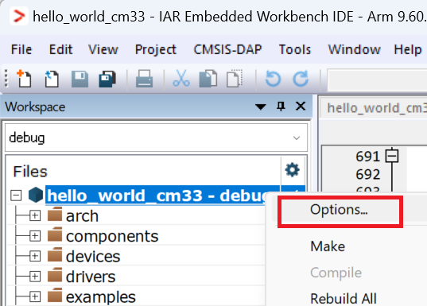
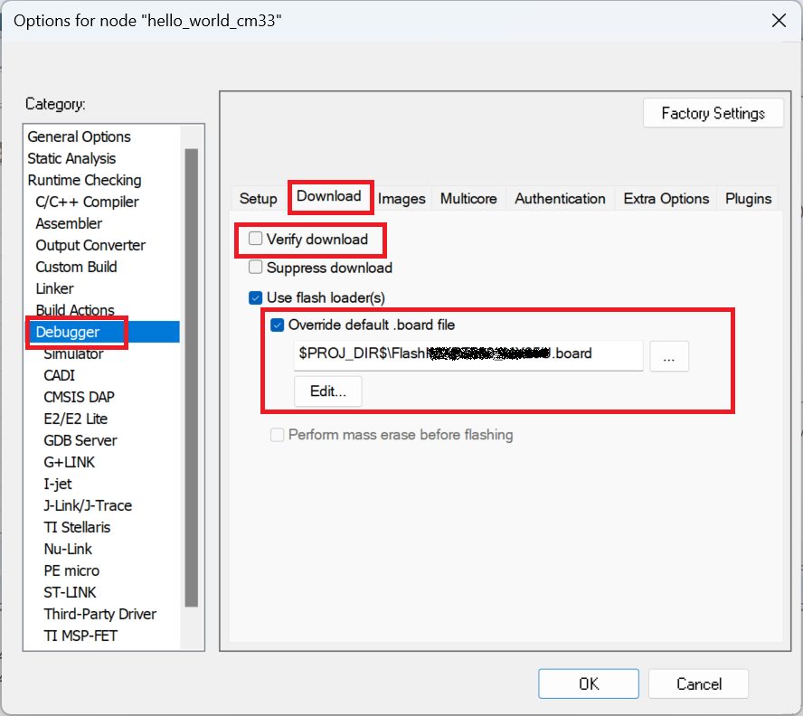
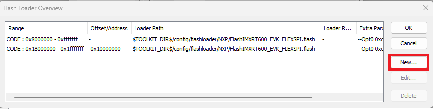
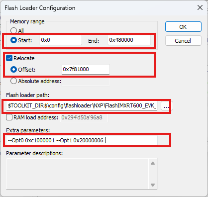
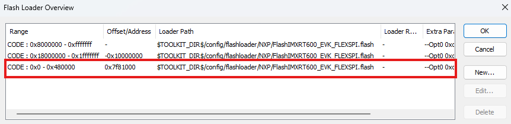

# IAR RAM debugging notes

In the SDK examples, there are many build configurations. For example, debug, release, flash\_debug, and flash\_release. The debug/release configuration demonstrates the application running in RAM, while flash\_debug/flash\_release runs in the flash \(XIP\).

XIP debugging is clean with the "**boot from flash**" setting on the board because the debugging has the same sequence as a normal boot.

The debugging steps are as follows:

1.  The debugger downloads the image to the flash.
2.  The debugger resets the device and boots from ROM.
3.  The debugger halts the device and waits for the command from the user.

However, with RAM debugging with the *boot from flash* setting on the board, the situation is complicated.

1.  The debugger downloads the image to the RAM.
2.  The debugger resets the device and boots it from ROM.

    **Note:** The image downloaded for debugging and the image running from the flash are different. The images are different because the image in flash might be written by the previous debugging.

3.  The debugger halts the device and sets the PC register value to the entry address of the downloaded image.

The problem here is that step 2 might overwrite the RAM written in step 1. The other issue is that the hardware status is undetermined when PC is set to the start of the RAM application.

To avoid the RAM debugging issue, MCUX IDE/armgcc/MDK provides a plain load feature. To get a clean debugging status, the RAM image is downloaded to the flash.

IAR needs a special setting to achieve the plain load feature as follows:

1.  Right-click the project and select **Options**.

    

2.  Select **Debugger \> Download** in the **Options for node <*project_name*>** dialog box.
3.  Clear the **Verify download** checkbox because the download address is different from the real address.
4.  Select the **Override default.board file** option.
5.  Copy the default \*.board file to the IAR workspace folder.
6.  Change the \*.board file path.
7.  Click the **Edit** button.

    

8.  Create a range for RAM.

    

9.  Set the memory range, relocate offset, and flashloader path.

    

    The new RAM range appears in the flashloader overview.

    

10. Follow the instructions in [Run an example application](run_an_example_application.md) and now it is safe to debug the RAM application. As a result, the downloaded RAM application can also boot on reset.

**Parent topic:**[Run a demo application using IAR](../topics/run_a_demo_application_using_iar.md)

