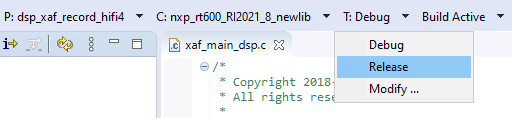

# Launch DSP Application from Arm Core

In the previous example, the Arm application and DSP application are independently loaded and debugged. This section list the steps to produce one Arm application binary that includes and starts the DSP application without the use of a debugger or a loader.

The Arm core application for each DSP demo uses a global preprocessor macro to control loading of the DSP binary application:

DSP\_IMAGE\_COPY\_TO\_RAM

When this macro is set to ‘1’/TRUE \(default value\), it instructs the DSP demo application to do the following:

-   Link the DSP application binary images into the Arm binary
-   Copy the DSP application images into RAM on program boot
-   Initialize the DSP to run from the RAM image

**Note:** When modifying the Arm project, make sure to supply the global preprocessor macro to both the C compiler and assembler.

To build the DSP application image for the Arm application, select the **Release** target option in the Xplorer IDE. For more information on building with min-rt LSP, see section [Link DSP Profiles](link_dsp_profiles.md).

|

|

Three DSP binaries are generated and are loaded into different TCM or SRAM address segments:

-   `<SDK_ROOT>/boards/evkmimxrt685/dsp_examples/xaf_record/dsp/binary/**dsp\_data\_release.bin**`

-   `<SDK_ROOT>/boards/evkmimxrt685/dsp_examples/xaf_record/dsp/binary/**dsp\_text\_release.bin**`

-   `<SDK_ROOT>/boards/evkmimxrt685/dsp_examples/xaf_record/dsp/binary/**dsp\_ncache\_release.bin**`

    **Note:** Depending on the environment, there might be a need to copy the binary images into the Arm application workspace.

**Parent topic:**[Run and Debug DSP Demo using Xplorer IDE](../topics/run_and_debug_dsp_demo_using_xplorer_ide.md)

