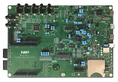

.. _mimxrt685audevk:

MIMXRT685-AUD-EVK
####################

Overview
********

| This i.MX RT600 EVK (MIMXRT685-AUD-EVK) features NXPs advanced implementation of the Arm Cortex-M33 core, combined with the highly optimized Cadence Tensilica HiFi 4 DSP processor core. The MIMXRT685-AUD-EVK supports development for the MIMXRT685 product and its features make it ideal for ML/AI, voice and audio applications. The i.MX RT600 AUD-EVK can help jumpstart your next design with the included schematics and layout files.

MCU device and part on board is shown below:

 - Device: MIMXRT685S
 - PartNumber: MIMXRT685SFVKB

Getting Started
****************
.. toctree::
   :maxdepth: 1
   :caption: Getting Started with MCUXpresso SDK for EVK-MIMXRT685

   gettingStarted/gsindex.md

Getting Started
****************
.. toctree::
   :maxdepth: 1
   :caption: Getting Started with Xplorer for EVK-MIMXRT685

   gettingStartedXplorer/gsxindex.md
Release Notes
****************
.. toctree::
   :maxdepth: 1
   :caption: MCUXpresso SDK Release Notes for MIMXRT685-AUD-EVK

   releaseNotes/rnindex.md
