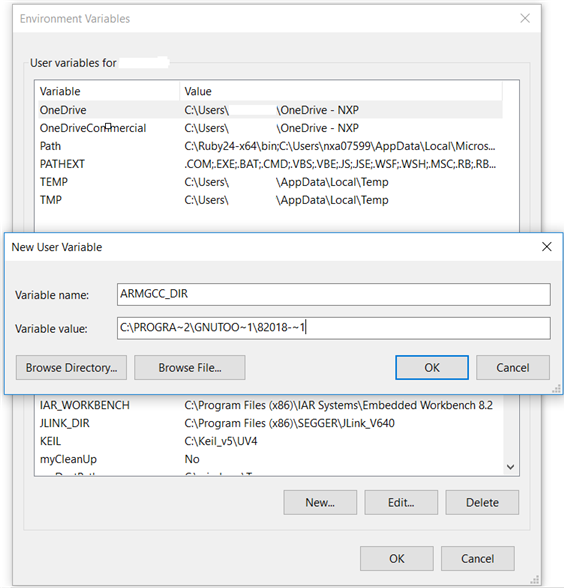

# Add a new system environment variable for `ARMGCC_DIR` 

Create a new *system* environment variable and name it as `ARMGCC_DIR`. The value of this variable should point to the Arm GCC Embedded tool chain installation path. For this example, the path is:

See the installation folder of the GNU Arm GCC Embedded tools for the exact pathname of your installation.

Short path should be used for path setting, you could convert the path to short path by running command `for %I in (.) do echo %~sI` in above path.

**Parent topic:**[Set up toolchain](../topics/armgcc_set_up_toolchain.md)

