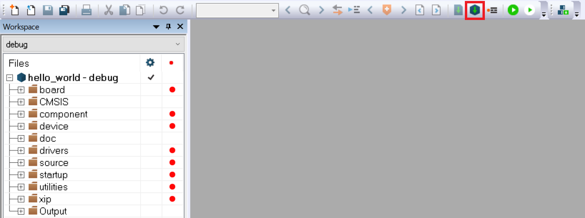

# Build an example application 

Do the following steps to build the `hello_world` example application.

1.  Open the desired demo application workspace. Most example application workspace files can be located using the following path:

    ```
    <install_dir>/boards/<board_name>/<example_type>/<application_name>/iar
    ```

    Using the MIMXRT700-EVK hardware platform as an example, the `hello_world` workspace is located in:

    ```
    <install_dir>/boards/mimxrt700evk/demo_apps/hello_world/cm33_core0/iar/hello_world_cm33_core0.eww
    ```

    Other example applications may have additional folders in their path.

2.  Select the desired build target from the drop-down menu.

    For this example, select **hello\_world** – **debug**.

    

3.  To build the demo application, click **Make**, highlighted in red in [Figure 2](#fig_BUILDINGDEMOAPP).

    

4.  The build completes without errors.

**Parent topic:**[Run a demo application using IAR](../topics/run_a_demo_application_using_iar.md)

