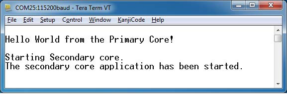

# Run a multicore example application 

The primary core debugger handles flashing of both the primary and the auxiliary core applications into the SoC flash memory. To download and run the multicore application, switch to the primary core application project and perform all steps as described in [Run an example application](ide_run_an_example_application.md). These steps are common for both single-core applications and the primary side of dual-core applications, ensuring both sides of the multicore application are properly loaded and started. Select the `cm33_core1` project and start debugging the `cm33_core1` project. Then, select the `cm33_core0` project and start debugging the `cm33_core0` project.

After clicking **Resume All Debug** sessions, the `hello_world` multicore application runs and a banner is displayed on the terminal. If this is not the case, check your terminal settings and connections.

**Parent topic:**[Run a demo using MCUXpresso IDE](../topics/run_a_demo_using_ide.md)

