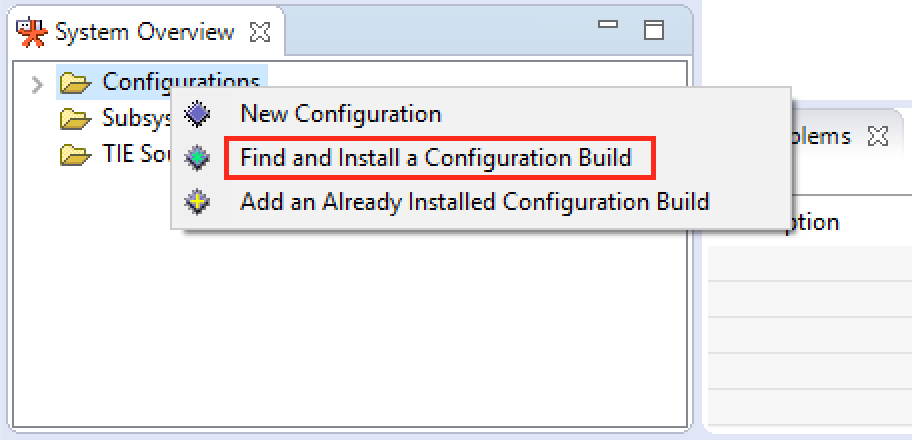
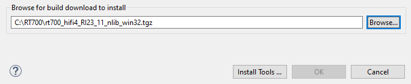

# Install RT700 DSP Build Configuration

‘*Build Configuration*’ is a term that describes all parameters and necessary build includes for the Tensilica processor implementation for development. It is mandatory to install a specific build configuration before starting development on RT700.

The build configuration is provided by NXP as a binary file and is imported into the Xplorer IDE. The binary file for the OS is available at the Tensilica URL: [https://tensilicatools.com/download/rt700-download-page/](https://tensilicatools.com/download/rt700-download-page/).

|

|

The build configuration is installed into the IDE using the **System Overview** panel available in the lower left corner, by default. If the **System Overview** panel is not visible, toggle using the **Window \> Show View \> System Overview** menu item.

|

|

Click **OK** for build download to install.

|

|

**Parent topic:**[Install Xplorer Toolchains](../topics/install_xplorer_toolchains.md)

