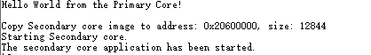

# Run a multicore example application 

This section describes the steps to run a multicore example application. The primary core debugger flashes both the primary and the auxiliary core applications into the SoC flash memory.

1.  To download and run the multicore application, switch to the primary core application project and perform [Step 1](keil_run_an_example_application.md#step1) – [Step 3](keil_run_an_example_application.md#step3), as described in [Run an example application](keil_run_an_example_application.md).
2.  Run the primary core project and then run the secondary core project.
3.  `Hello_World` multicore demos are now running. A banner appears on the terminal and the LED blinks. If this is not true, check your terminal settings and connections.

    

**Parent topic:**[Run a demo using Keil MDK/μVision](../topics/run_a_demo_using_keil_mdk_vision.md)

