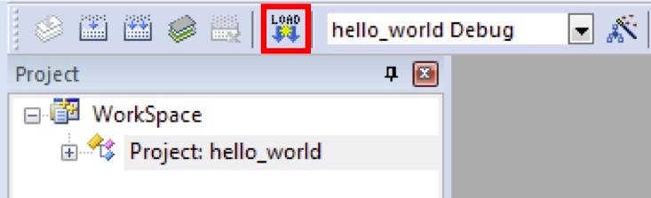
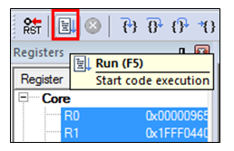
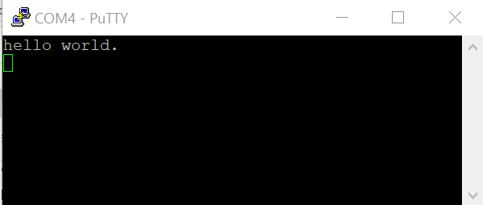

# Run an example application

To download and run the application, perform these steps:

1.  Determine the debug interface that comes loaded on your specific hardware platform.

    -   For boards with the CMSIS-DAP/mbed/DAPLink interface, visit Windows serial configuration and follow the instructions to install the Windows operating system serial driver. If running on Linux operating system, this step is not required.
    -   If using J-Link either a standalone debug pod or MCU-LINK, install the J-Link software \(drivers and utilities\) from Segger.
2.  Connect the development platform to your PC via USB cable using MCU-LINK USB connector.
3.  Open the terminal application on the PC, such as PuTTY or TeraTerm, and connect to the debug serial port number \(to determine the COM port number, see [How to determine COM port](how_to_determine_com_port.md)\). Configure the terminal with these settings:

    -   115200 or 9600 baud rate, depending on your board \(reference the `BOARD_DEBUG_UART_BAUDRATE` variable in the *board.h* file\)
    -   No parity
    -   8 data bits
    -   1 stop bit
     configurations")

4.  In μVision, after the application is built, click the **Download** button to download the application to the target.

    

5.  After clicking the **Download** button, the application downloads to the target and is running. To debug the application, click the **Start/Stop Debug Session** button, highlighted in red in [Figure 3](#fig_stop).

     when run debugging")

6.  Run the code by clicking the **Run** button to start the application.

    

The `hello_world` application is now running and a banner is displayed on the terminal. If this does not appear, check your terminal settings and connections.

**Parent topic:**[Run a demo using Keil MDK/μVision](../topics/run_a_demo_using_keil_mdk_vision.md)

