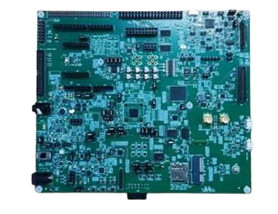

:pdf-download: ../../../_assets/boards/mimxrt700evk/mcuxsdk-mimxrt700evk.pdf
.. _mimxrt700evk:

MIMXRT700-EVK
####################

Overview
********

The i.MX RT700 EVK (MIMXRT700-EVK) features NXPs advanced implementation of the Arm Cortex-M33 core, combined with the highly optimized Cadence Tensilica HiFi4 and HiFi1 DSP processor cores. MIMXRT700-EVK supports development for the MIMXRT798, MIMXRT758 and MIMXRT735 products and its features make it ideal for portable HMI applications. The i.MX RT700 EVK can help jump start your next design with the included schematics and layout files.

MCU device and part on board is shown below:

 - Device: MIMXRT798S
 - PartNumber: MIMXRT798SGFOB

Getting Started with MCUXpresso SDK Package
*******************************************
.. toctree::
   :maxdepth: 1

   gettingStarted/gsindex.md

Getting Started with MCUXpresso SDK GitHub
*******************************************
.. toctree::
   :maxdepth: 1

   ../../../gsd/repo.rst

Getting Started with MCUXpresso SDK Xplorer
*******************************************
.. toctree::
   :maxdepth: 1

   gettingStartedXplorer/gsxindex.md

Release Notes
*******************************************
.. toctree::
   :maxdepth: 1

   releaseNotes/rnindex.md

ChangeLog
*******************************************
.. toctree::
   :maxdepth: 1

   changeLog/clindex.md

Driver API Reference Manual
****************************

This section provides a link to the Driver API RM, detailing available drivers and their usage to help you integrate hardware efficiently.

:ref:`MIMXRT798S_drivers`

Middleware Documentation
*****************************

Find links to detailed middleware documentation for key components. While not all onboard middleware is covered, this serves as a useful reference for configuration and development.

VG-Lite GPU Library
===================

:ref:`vglite`

Multicore
=========

:ref:`multicore`

MCU Boot
========

:doc:`mcuboot_opensource<../../../middleware/mcuboot_opensource/README.md>`

eIQ
===

:ref:`eiq`

FreeMASTER
==========

:doc:`freemaster <../../../middleware/freemaster/doc/index>`

AWS IoT
=======

:ref:`aws_iot`

NXP Wi-Fi
=========

:ref:`wifi-bluetooth-802.15.4`

FreeRTOS
========

:ref:`freertos`

Wireless EdgeFast Bluetooth PAL
===============================

:ref:`edgefast_bluetooth`

lwIP
====

:ref:`lwip`

File systemFatfs
================

:ref:`fatfs`

DSP Audio Streamer
==================

:ref:`multicore-xaf`
