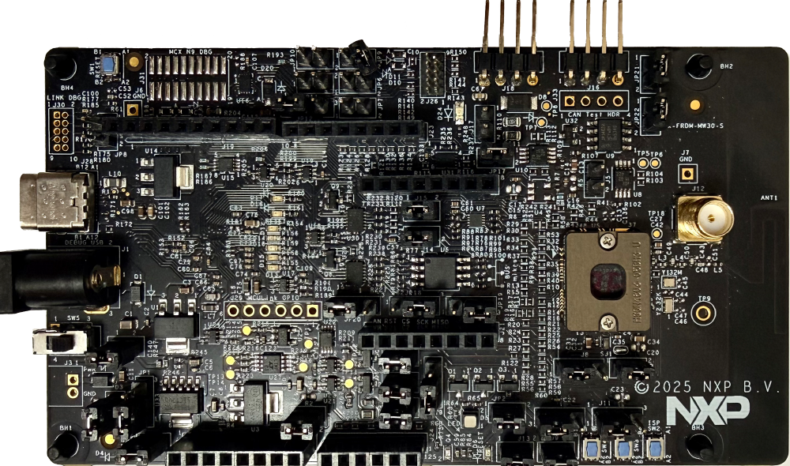

:pdf-download: ../../../_assets/boards/frdmkw43/mcuxsdk-frdmkw43.pdf

.. _frdmkw43:

FRDM-KW43
####################

Overview
********

The FRDM-KW43 is an automotive evaluation kit development board for advanced development of the KW43 wireless MCU. It offers exhaustive evaluation of KW43 MCUs with 2.4 GHz Bluetooth Low Energy and generic FSK wireless connectivity and CAN/LIN connectivity.
The board includes an advanced MCU-Link debug probe, Power and low power option, CAN and LIN transceivers, buttons, switches, LEDs and integrated sensors, Arduino shield connectors, a MikroE Click connector and other headers.

MCU device and part on board is shown below:

 - Device: KW43B43ZC7
 - PartNumber: KW43B43ZC7MFT

Getting Started with MCUXpresso SDK Package
*******************************************
.. toctree::
   :maxdepth: 1

   gettingStarted/gsindex.md

Getting Started with MCUXpresso SDK GitHub
*******************************************
.. toctree::
   :maxdepth: 1

   ../../../gsd/repo.rst

Release Notes
*******************************************

**This is an early adopter release provided as preview for development with pre-production devices.**

.. toctree::
   :maxdepth: 1

   releaseNotes/rnindex.md

ChangeLog
*******************************************
.. toctree::
   :maxdepth: 1

   changeLog/clindex.md

Driver API Reference Manual
****************************

This section provides a link to the Driver API RM, detailing available drivers and their usage to help you integrate hardware efficiently.

:ref:`KW43B43ZC7_drivers`

Middleware Documentation
*****************************

Find links to detailed middleware documentation for key components. While not all onboard middleware is covered, this serves as a useful reference for configuration and development.

Wireless Bluetooth LE host stack and applications
=================================================

:ref:`examples__wireless_examples__bluetooth_docs`

Wireless Connectivity Framework
===============================

:doc:`framework <../../../middleware/wireless/framework/index>`

FreeRTOS
========

:ref:`freertos`
