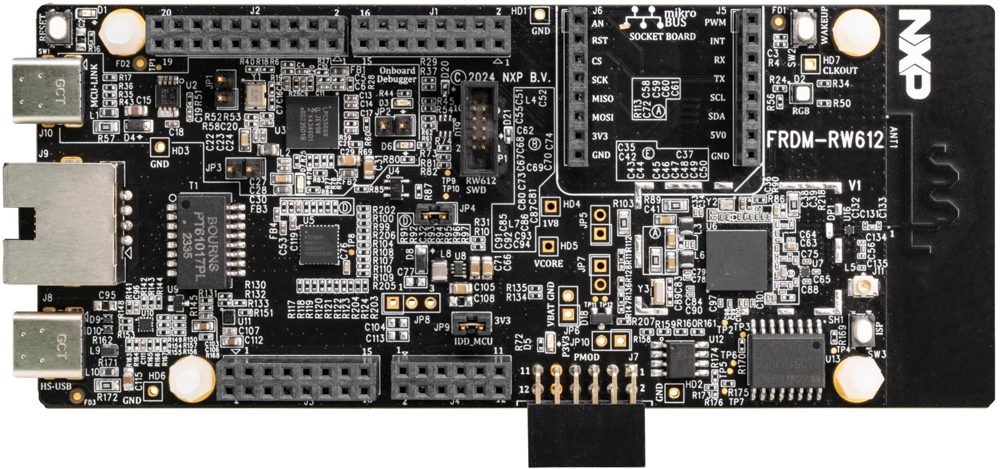

.. _frdmrw612:

FRDM-RW612
####################

Overview
********

FRDM-RW612 is a compact and scalable development board for rapid prototyping of the RW61x series of Wi-Fi 6 + Bluetooth Low Energy + 802.15.4 tri-radio wireless MCUs. It offers easy access to the MCU’s I/Os and peripherals, integrated open-standard serial interfaces, external flash memory and on-board MCU-Link debugger.

MCU device and part on board is shown below:

 - Device: RW612
 - PartNumber: RW612ETA2I

Getting Started with MCUXpresso SDK Package
*******************************************
.. toctree::
   :maxdepth: 1

   gettingStarted/gsindex.md

Getting Started with MCUXpresso SDK GitHub
*******************************************
.. toctree::
   :maxdepth: 1

   ../../../gsd/repo.rst

Release Notes
*******************************************
.. toctree::
   :maxdepth: 1

   releaseNotes/rnindex.md

ChangeLog
*******************************************
.. toctree::
   :maxdepth: 1

   changeLog/clindex.md

Driver API Reference Manual
****************************

This section provides a link to the Driver API RM, detailing available drivers and their usage to help you integrate hardware efficiently.

:ref:`RW612_drivers`

Middleware Documentation
*****************************

Find links to detailed middleware documentation for key components. While not all onboard middleware is covered, this serves as a useful reference for configuration and development.

Wireless Connectivity Framework
===============================

.. toctree::
   :maxdepth: 1

   ../../../middleware/wireless/framework/index.rst

MCU Boot
========

.. toctree::
   :maxdepth: 1

   ../../../middleware/mcuboot_opensource/README.md

FreeMASTER
==========

.. toctree::
   :maxdepth: 1

   ../../../middleware/freemaster/doc/index.md

AWS IoT
=======

:ref:`aws_iot`

NXP Wi-Fi
=========

:ref:`Wi-Fi`

FreeRTOS
========

:ref:`freertos`

Wireless EdgeFast Bluetooth PAL
===============================

:ref:`edgefast_bluetooth`

lwIP
====

:ref:`lwip`

File systemFatfs
================

:ref:`fatfs`
