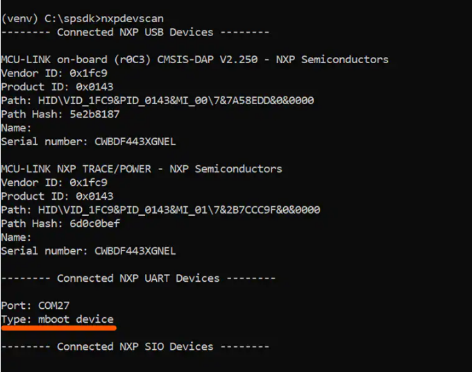

# Updating NBU for Wireless Examples

**Alert code:**

CAUTION:
It is necessary to work with the matching NBU image for the SDK version of the application you are working with. This means that when you download your SDK, prior to loading any wireless SDK example, update your NBU image with the provided binaries in the following folder of the SDK: ../middleware/wireless/ble-controller/bin.

Here you will find two type of images for the NBU FW:

1. SB3 File Type
    - This is for EVK users only. The EVK's come programmed with set keys for ease of use in development

2. XIP File Type
    - This is for samples that are not programmed with any keys. For these devices, you can create your custom keys, then create an SB3 file based on this XIP image

    

To update the NBU, you may use the SPSDK command line tool.

1. Open the path to your SPSDK folder and activate the virtual environment
    - `>> venv\Scripts\activate`
2. Place your device in ISP mode. For this example we will use the UART peripheral by connecting a USB cable to `J14`. On the EVK you can enter ISP by the following method
    - Make sure a jumper is on `JP25`
    - Press and hold `SW4`, press and release Reset, and then release `SW4`
3. Once the device is connected you may check your devices available using SPSDK to find the COM port it is connected to.
    - `>> nxpdevscan`

4. Then you may run the 'receive-sb-file' command to load the sb3 file.
    - `>> blhost -p COM27 receive-sb-file path_to_SDK\kw45b41_nbu_ble_hosted_a1.sb3`
