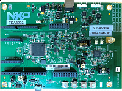

.. _kw45b41zevk:

KW45B41Z-EVK
####################

Overview
********

The KW45B41Z EVK is an evaluation kit for KW45 MCUs with 2.4 GHz Bluetooth Low Energy and generic FSK wireless connectivity and CAN/LIN connectivity. The KW45's highly sensitive, optimized 2.4 GHz radio features a PCB F-antenna which can be bypassed to test via SMA connection. The board includes an MCU-Link debug probe, CAN and LIN transceivers, buttons, switches, LEDs and integrated sensors, Arduino shield connectors, a MikroE Click connector and other headers.

MCU device and part on board is shown below:

 - Device: KW45B41Z83
 - PartNumber: KW45B41Z83AFTA

Getting Started with MCUXpresso SDK Package
*******************************************
.. toctree::
   :maxdepth: 1

   gettingStarted/gsindex.md

Getting Started with MCUXpresso SDK GitHub
*******************************************
.. toctree::
   :maxdepth: 1

   ../../../gsd/repo.rst

Release Notes
*******************************************
.. toctree::
   :maxdepth: 1

   releaseNotes/rnindex.md