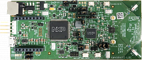

.. _kw45b41zloc:

KW45B41Z-LOC
####################

Overview
********

The KW45B41Z LOC is an evaluation kit for KW45 Automotive MCU with 2.4 GHz Bluetooth Low Energy and generic FSK wireless connectivity and CAN/LIN connectivity. This platform is dedicated to Narrow band Wireless Ranging and it will help you to prepare the implementation of your Bluetooth Channel Sounding solution. The KW45's highly sensitive, optimized 2.4 GHz radio features is featured with antenna diversity via RF switch.

MCU device and part on board is shown below:

 - Device: KW45B41Z83
 - PartNumber: KW45B41Z83AFTA

Getting Started with MCUXpresso SDK Package
*******************************************
.. toctree::
   :maxdepth: 1

   gettingStarted/gsindex.md

Getting Started with MCUXpresso SDK GitHub
*******************************************
.. toctree::
   :maxdepth: 1

   ../../../gsd/repo.rst

Release Notes
*******************************************
.. toctree::
   :maxdepth: 1

   releaseNotes/rnindex.md

ChangeLog
*******************************************
.. toctree::
   :maxdepth: 1

   changeLog/clindex.md
