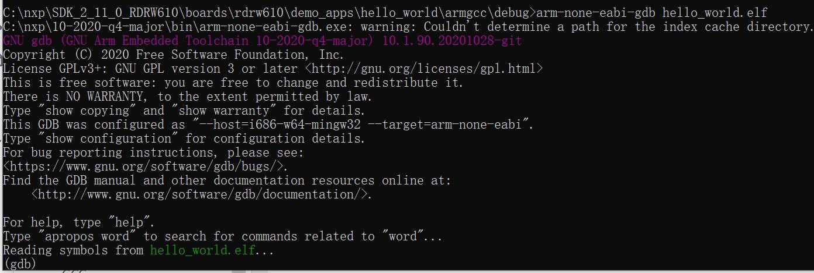

# Run an example application

This section describes steps to run a demo application using J-Link GDB Server application. To update the on-board LPC-Link2 debugger to Jlink firmware, see [Updating debugger firmware](updating_debugger_firmware.md#).

After the J-Link interface is configured and connected, follow these steps to download and run the demo applications:

1.  Connect the development platform to your PC via USB cable between the LPC-Link2 USB connector and the PC USB connector. If using a standalone J-Link debug pod, connect it to the SWD/JTAG connector of the board.
2.  Open the terminal application on the PC, such as PuTTY or TeraTerm, and connect to the debug serial port number \(to determine the COM port number, see [How to determine COM port](how_to_determine_com_port.md#)\). Configure the terminal with these settings:

    1.  115200 or 9600 baud rate, depending on your board \(reference `BOARD_DEBUG_UART_BAUDRATE` variable in `board.h` file\)
    2.  No parity
    3.  8 data bits
    4.  1 stop bit

        | configurations")

|

    **Note:** Before debugging, it is recommend that the board is set to the FlexSPI flash boot mode \(CON\[3:0\]: \[off, off, off, off\]\). If there is no bootable image in a flash, set CON\[3:0\] to all "on" and download the image. Change the flash boot mode and gdb debug again.

3.  Open the J-Link GDB Server application.
4.  Select "RW610" as the target device and "SWD" as the target interface.
5.  After it is connected, the screen appears as in [Figure 2](run_an_example_application_002.md#JWGDW).

    |

|

6.  If not already running, open a GCC Arm Embedded tool chain command window. To launch the window, from the Windows operating system Start menu, go to **Programs** \> **GNU Tools Arm Embedded <version\>** and select **GCC Command Prompt**.

    |

|

7.  Change to the directory that contains the example application output. The output can be found in using one of these paths, depending on the build target selected:

    ```
    <install_dir>/boards/<board_name>/<example_type>/<application_name>/armgcc/debug
    ```

    ```
    <install_dir>/boards/<board_name>/<example_type>/<application_name>/armgcc/release
    ```

    For this example, the path is:

    ```
    <install_dir>/boards/rdrw61x/demo_apps/hello_world/armgcc/debug
    ```

8.  Run the `arm-none-eabi-gdb.exe <application_name>.elf` command. For this example, it is `arm-none-eabi-gdb.exe hello_world.elf`.

    |

|

9.  Run these commands:
    1.  `target remote localhost:2331`
    2.  `monitor reset`
    3.  `load`
    4.  `monitor reset`
10. The application is now downloaded and halted at the watch point. Execute the `monitor go` command to start the demo application.

    The `hello_world` application is now running and a banner is displayed on the terminal. If this does not appear, check your terminal settings and connections.

    |

|


**Parent topic:**[Run a demo using Arm GCC](../topics/run_a_demo_using_arm__gcc.md)

