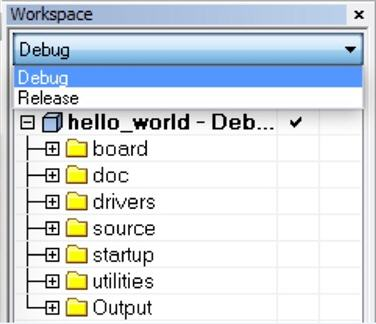

# Build an example application

Perform the following steps to build the `hello_world` example application.

1.  Open the desired demo application workspace. Most example application workspace files can be located using the following path:

    ```
    <install_dir>/boards/<board_name>/<example_type>/<application_name>/iar
    ```

    For using MIMX8ULP-EVK hardware platform as an example, the `hello_world` workspace is located at:

    ```
    <install_dir>/boards/evkmimx8ulp/demo_apps/hello_world/iar/hello_world.eww
    ```

    Other example applications may have additional folders in the respective paths.

2.  Select the desired build target from the drop-down menu.

    For this example, select **hello\_world** – **Debug**.

    |

|

3.  To build the demo application, click **Make**, highlighted in red in [Figure 2](build_an_example_application_002.md#BUILDINGDEMOAPP).

    |

|

4.  The build completes without errors.

**Note:** To run the application, see the [Run an application using imx-mkimage](running_an_application_using_imx-mkimage.md).

**Parent topic:**[Running a demo application using IAR](../topics/running_a_demo_application_using_iar.md)

