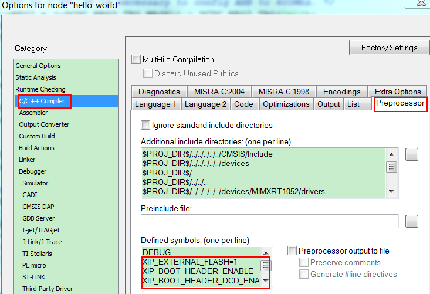

# How to add or remove boot header for XIP targets {#GUID-82961617-9610-4E46-97D6-C581407B732B}

The MCUXpresso SDK for i.MX RT1050 provides `flexspi_nor_debug` and `flexspi_nor_release` targets for each example and/or demo which supports XIP \(eXecute-In-Place\). These two targets add `XIP_BOOT_HEADER` to the image by default. Because of this, ROM can boot and run this image directly on external flash.

**Macros for the boot leader:**

-   The following three macros are added in `flexspi_nor` targets to support XIP, as described in [Table 1](how_to_add_or_remove_boot_header_for_xip_targets.md#TABLE_HBQ_GX5_5CB).

    ^

    |**XIP\_EXTERNAL\_FLASH**|1: Exclude the code which changes the clock of FLEXSPI.|
    |0: Make no changes.|
    |**XIP\_BOOT\_HEADER\_ENABLE**|1: Add FLEXSPI configuration block, image vector table, boot data, and device configuration data \(optional\) to the image by default.|
    |0: Add nothing to the image by default.|
    |**XIP\_BOOT\_HEADER\_DCD\_ENABLE**|1: Add device configuration data to the image.|
    |0: Do **NOT** add device configuration data to the image.|

-   [Table 2](how_to_add_or_remove_boot_header_for_xip_targets.md#TABLE_YK2_PX5_5CB) shows the different effect on the built image with a different combination of these macros.

    ^

    ||**XIP\_BOOT\_HEADER\_DCD\_ENABLE=1**|**XIP\_BOOT\_HEADER\_DCD\_ENABLE=0**|
    |--|------------------------------------|------------------------------------|
    |**XIP\_EXTERNAL\_FLASH=1**|**XIP\_BOOT\_HEADER\_ENABLE=1**|    -   Can be programmed to `hyperflash` by IDE and can run after POR reset if `hyperflash` is the boot source.
    -   SDRAM will be initialized.
|    -   Can be programmed to `hyperflash` by IDE, and can run after POR reset if `hyperflash` is the boot source.
    -   SDRAM will **NOT** be initialized.
|
    |**XIP\_BOOT\_HEADER\_ENABLE=0**|    -   **CANNOT** run after POR reset if it is programmed by IDE, even if `hyperflash` is the boot source.
|
    |**XIP\_EXTERNAL\_FLASH=0**|    -   This image **CANNOT** complete XIP because when this macro is set to 1, it excludes the code, which changes the clock for FLEXSPI.
|

**Where to change the macros for each toolchain in MCUXpresso SDK?**

Take `hello_world` as an example:

-   **IAR**

    

-   **MDK**

    

-   **ARMGCC**

    Change the configuration in CMakeLists.txt.

    

-   **MCUX**

    

