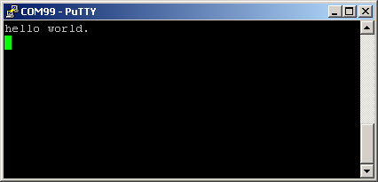

# Run an example application

To download and run the application, perform these steps:

1.  This board supports the CMSIS-DAP/mbed/DAPLink debug probe by default. Visit [os.mbed.com/handbook/Windows-serial-configuration](https://os.mbed.com/handbook/Windows-serial-configuration) and follow the instructions to install the Windows® operating system serial driver. If running on Linux OS, this step is not required.
2.  Connect the development platform to your PC via USB cable. Connect the USB cable to J28 and make sure SW7\[1:4\] is **0010b**.
3.  Open the terminal application on the PC, such as PuTTY or TeraTerm, and connect to the debug COM port \(to determine the COM port number, see [How to determine COM port](how_to_determine_com_port.md#)\). Configure the terminal with these settings:
    1.  115200 or 9600 baud rate, depending on your board \(reference `BOARD_DEBUG_UART_BAUDRATE` variable in the `board.h` file\)
    2.  No parity
    3.  8 data bits
    4.  1 stop bit

         configuration")

4.  In IAR, click the **Download and Debug** button to download the application to the target.

    

5.  The application is then downloaded to the target and automatically runs to the `main()` function.

6.  Run the code by clicking the **Go** button to start the application.

    

7.  The `hello_world` application is now running and a banner is displayed on the terminal. If this is not true, check your terminal settings and connections.

    

**Parent topic:**[Run a demo application using IAR](../topics/run_a_demo_application_using_iar.md)

