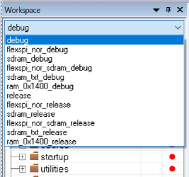
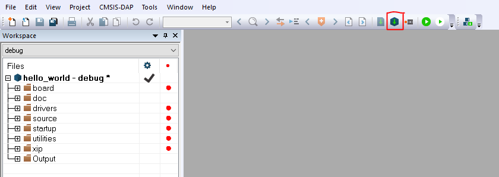

# Build an example application

Do the following steps to build the `hello_world` example application.

1.  Open the desired demo application workspace. Most example application workspace files can be located using the following path:

    ```
    <install_dir>/boards/<board_name>/<example_type>/<application_name>/iar
    ```

    Using the MIMXRT1060-EVK hardware platform as an example, the `hello_world` workspace is located in:

    ```
    <install_dir>/boards/evkmimxrt1060/demo_apps/hello_world/iar/hello_world.eww
    ```

    Other example applications may have additional folders in their path.

2.  Select the desired build target from the drop-down menu.

    There are twelve project configurations \(build targets\) supported for most MCUXpresso SDK projects:

    -   `Debug` – Compiler optimization is set to low, and debug information is generated for the executable. The linker file is `RAM` linker, where text and data section is put in internal TCM.
    -   `Release` – Compiler optimization is set to high, and debug information is not generated. The linker file is `RAM` linker, where text and data section is put in internal TCM.
    -   `ram_0x1400_debug` – Project configuration is same as the debug target. The linker file is `RAM_0x1400` linker, where text is put in ITCM with offset 0x1400 and data put in DTCM.
    -   `ram_0x1400_release` – Project configuration is same as the release target. The linker file is `RAM_0x1400` linker, where text is put in ITCM with offset 0x1400 and data put in DTCM.
    -   `sdram_debug` – Project configuration is same as the debug target. The linker file is `SDRAM` linker, where text is put in internal TCM and data put in SDRAM.
    -   `sdram_release` – Project configuration is same as the release target. The linker file is `SDRAM` linker, where text is put in internal TCM and data put in SDRAM.
    -   `sdram_txt_debug` – Project configuration is same as the debug target. The linker file is `SDRAM_txt` linker, where text is put in SDRAM and data put in OCRAM.
    -   `sdram_txt_release` – Project configuration is same as the release target. The linker file is `SDRAM_txt` linker, where text is put in SDRAM and data put in OCRAM.
    -   `flexspi_nor_debug` – Project configuration is same as the debug target. The linker file is `flexspi_nor` linker, where text is put in flash and data put in TCM.
    -   `flexspi_nor_release` – Project configuration is same as the release target. The linker file is `flexspi_nor` linker, where text is put in flash and data put in TCM.
    -   `flexspi_nor_sdram_release` - Project configuration is same as the release target. The linker file is `flexspi_nor_sdram` linker, where text is put in flash and data put in SDRAM.
    -   `flexspi_nor_sdram_debug` – Project configuration is same as the debug target. The linker file is `flexspi_nor_sdram` linker, where text is put in flash and data put in SDRAM.
    For some examples need large data memory, only `sdram_debug` and `sdram_release` targets are supported.

    For this example, select **hello\_world** – **debug**.

    |

|

3.  To build the demo application, click **Make**, highlighted in red in [Figure 2](build_an_example_application_002.md#BUILDINGDEMOAPP).

    |

|

4.  The build completes without errors.

**Parent topic:**[Run a demo application using IAR](../topics/run_a_demo_application_using_iar.md)

