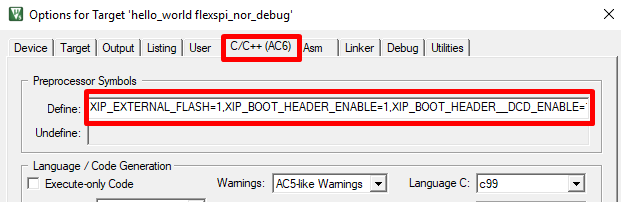
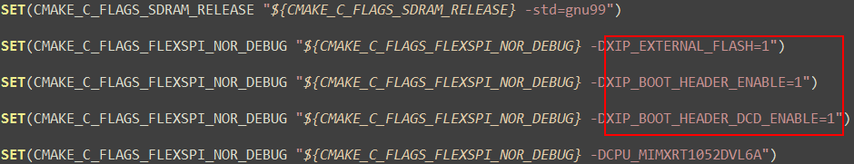

# How to add or remove boot header for XIP targets

The MCUXpresso SDK for i.MX RT1060-EVKB provides `flexspi_nor_debug` and `flexspi_nor_release` targets for each example and/or demo which supports XIP \(eXecute-In-Place\). These two targets add `XIP_BOOT_HEADER` to the image by default. Because of this, ROM can boot and run this image directly on external flash.

**Macros for the boot leader:**

**Where to change the macros for each toolchain in MCUXpresso SDK?**

Take `hello_world` as an example:

-   **IAR**

    |

|

-   **MDK**

    |

|

-   **ARMGCC**

    Change the configuration in CMakeLists.txt.

    |

|

-   **MCUX**

    |

|

