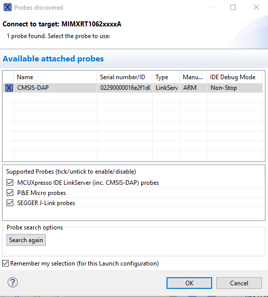
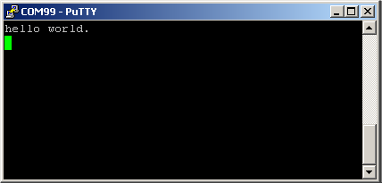

# Run an example application

For more information on debug probe support in the MCUXpresso IDE, visit [community.nxp.com](https://community.nxp.com/message/630901).

To download and run the application, perform these steps:

**Note:** Make sure that the board is on the QSPI\_Flash mode before download \(set SW4:0010\).

1.  On the **Quickstart Panel**, click **Debug evkbmimxrt1060\_demo\_apps\_hello\_world \[Debug\]**.

    |

|

2.  The first time you debug a project, the **Debug Emulator Selection Dialog** is displayed, showing all supported probes that are attached to your computer. Select the probe through which you want to debug and click **OK**. \(For any future debug sessions, the stored probe selection is automatically used, unless the probe cannot be found.\)

    |

|

3.  The application is downloaded to the target and automatically runs to `main()`.

    | when running
											debugging")

|

4.  Start the application by clicking the **Resume** button.

    |

|

The `hello_world` application is now running and a banner is displayed on the MCUXpresso IDE console window. If not, check your terminal settings and connections.

|

|

**Parent topic:**[Run a demo using MCUXpresso IDE](../topics/run_a_demo_using_mcuxpresso_ide.md)

