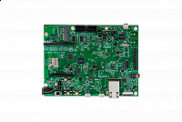

.. _evkbmimxrt1060:

MIMXRT1060-EVKB
####################

Overview
********

The i.MX RT1060 EVK is a 4-layer through-hole USB-powered PCB. At its heart lies the i.MX RT1060 crossover MCU, featuring NXPs advanced implementation of the Arm\ :sup:`` Cortex\ :sup:``-M7 core. This core operates at speeds up to 600 MHz to provide high CPU performance and excellent real-time response.

Support for FreeRTOS\ :sup:`` available within the MCUXpresso SDK.

The i.MX RT1060 Evaluation Kit is supported by Zephyr\ :sup:`` OS for developing the Internet of Things with a free, open-source embedded operating system. Click `here <https://docs.zephyrproject.org/latest/boards/arm/mimxrt1060_evk/doc/index.html?highlight=mimxrt1060_evk>`__ to learn more.

Rev B includes M.2 and audio interfaces.

MCU device and part on board is shown below:

 - Device: MIMXRT1062
 - PartNumber: MIMXRT1062DVL6B

Getting Started
****************
.. toctree::
   :maxdepth: 1
   :caption: Getting Started with MCUXpresso SDK for MIMXRT1060-EVKB

   gettingStarted/gsindex.md