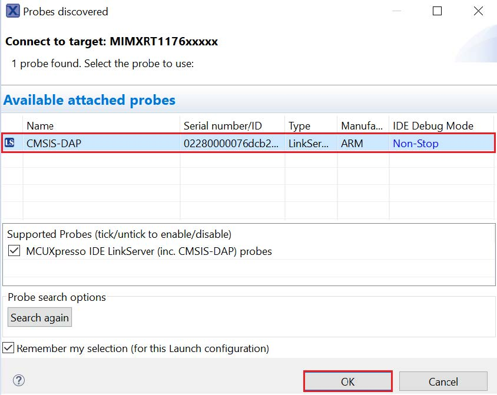

# Run a multicore example application

The primary core debugger handles flashing of both the primary and the auxiliary core applications into the SoC flash memory. To download and run the multicore application, switch to the primary core application project and perform all steps as described in [Run an example application](ide_run_an_example_application.md). These steps are common for both single-core applications and the primary side of dual-core applications, ensuring both sides of the multicore application are properly loaded and started. However, there is one additional dialogue that is specific to multicore examples which requires selecting the target core. See [Figure 1](#FIG_DEBUGHELLOWORLD) to [Figure 3](#FIG_STOPPRIMARYCORE) as reference.

**Note:** On MCUXpresso IDE, the feature to simultaneously debug two cores is only supported by CMSIS-DAP debugger.

 when running debugging")

After clicking **Resume All Debug** sessions, the `hello_world` multicore application runs and a banner is displayed on the terminal. If this is not the case, check your terminal settings and connections.

**Note:** There are some limitations on MCUXpresso IDE debugging. For details, see **Section 8.5 MCUXPresso IDE limitation** in *MCUXpresso SDK Release Notes for MIMXRT1170-EVKB* \(document MCUXSDKMIMXRT117XBRN\).

**Parent topic:**[Run a demo using MCUXpresso IDE](../topics/run_a_demo_using_mcuxpresso_ide.md)

