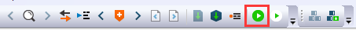
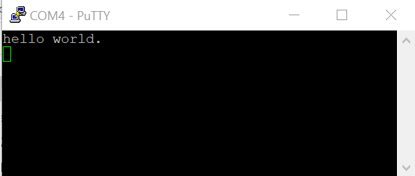

# Run an example application

To download and run the application, perform these steps:

1.  This board supports the J-Link debug probe. Before using it, install SEGGER J-Link software, which can be downloaded from [www.segger.com](www.segger.com).
2.  Connect the development platform to your PC via USB cable between the USB-UART MICRO USB connector and the PC USB connector, then connect 5 V power supply and J-Link Plus to the device.
3.  Open the terminal application on the PC, such as PuTTY or TeraTerm, and connect to the debug COM port \(to determine the COM port number, see Appendix A\). Configure the terminal with these settings:
    1.  115200 baud rate
    2.  No parity
    3.  8 data bits
    4.  1 stop bit

        | configuration")

|

4.  In IAR, click the "Download and Debug" button to download the application to the target.

    |

|

5.  The application is then downloaded to the target and automatically runs to the main\(\) function.

    | when running debugging")

|

6.  Run the code by clicking the "Go" button to start the application.

    |

|

7.  The hello\_world application is now running and a banner is displayed on the terminal. If this is not true, check your terminal settings and connections.

    |

|

**Parent topic:**[Run a demo application using IAR](../topics/run_a_demo_application_using_iar.md)

