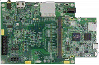

.. _evkmcimx7ulp:

EVK-MCIMX7ULP
####################

Overview
********

The i.MX7ULP family of boards provides a powerful and flexible development system for NXP's Cortex-M4 MCUs.

MCU device and part on board is shown below:

 - Device: MCIMX7U5
 - PartNumber: MCIMX7U5DVP07

