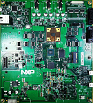

.. _evkmimx8dxl:

EVK-MIMX8DXL
####################

Overview
********

The i.MX8DXL family of boards provides a powerful and flexible development system for NXP's Cortex-M4 MCUs.

MCU device and part on board is shown below:

 - Device: MIMX8DL1
 - PartNumber: MIMX8DL1AVNFZ

