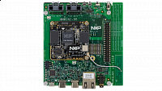

.. _evkmimx8mm:

EVK-MIMX8MM
####################

Overview
********

The i.MX 8M Mini family of boards provides a powerful and flexible development system for NXP's Cortex-M4 MCUs.

MCU device and part on board is shown below:

 - Device: MIMX8MM6
 - PartNumber: MIMX8MM6DVTLZ

