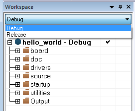
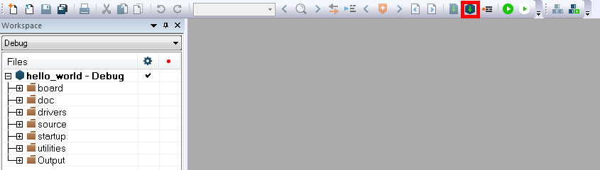

# Build an example application

Before using IAR, get the IAR patch, [iar\_support\_patch\_imx8mn.zip](https://www.nxp.com/webapp/sps/download/license.jsp?colCode=SDK_MX8MN_3RDPARTY_Patch&appType=file1&DOWNLOAD_ID=null). Install the i.MX8MN support patch following the guides in `readme.txt` located in the archive.

Do the following steps to build the `hello_world` example application.

1.  Open the desired demo application workspace. Most example application workspace files can be located using the following path:

    ```
    <install_dir>/boards/<board_name>/<example_type>/<application_name>/iar
    ```

    Using the i.MX 8MN EVK hardware platform as an example, the `hello_world` workspace is located in:

    ```
    <install_dir>/boards/evkmimx8mn/demo_apps/hello_world/iar/hello_world.eww
    ```

    Other example applications may have additional folders in their path.

2.  Select the desired build target from the drop-down menu.

    For this example, select **hello\_world** – **debug**.

    |

|

3.  To build the demo application, click **Make**, highlighted in red in [Figure 2](build_an_example_application_003.md#BUILDINGDEMOAPP).

    |

|

4.  The build completes without errors.

**Parent topic:**[Run a demo application using IAR](../topics/run_a_demo_application_using_iar.md)

