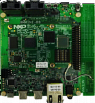

.. _evkmimx8mnddr3l:

EVK-MIMX8MNDDR3L
####################

Overview
********

The i.MX 8M Nano family of boards provides a powerful and flexible development system for NXP's Cortex-M7 MCUs.

MCU device and part on board is shown below:

 - Device: MIMX8MN6
 - PartNumber: MIMX8MN6DVTJZ

