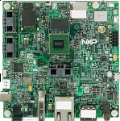

.. _evkmimx8mq:

EVK-MIMX8MQ
####################

Overview
********

The i.MX 8MQuad family of boards provides a powerful and flexible development system for NXP's Cortex-M4 MCUs.

MCU device and part on board is shown below:

 - Device: MIMX8MQ6
 - PartNumber: MIMX8MQ6DVAJZ

Getting Started
****************
.. toctree::
   :maxdepth: 1
   :caption: Getting Started with MCUXpresso SDK for EVK-MIMX8MQ

   gettingStarted/gsindex.md