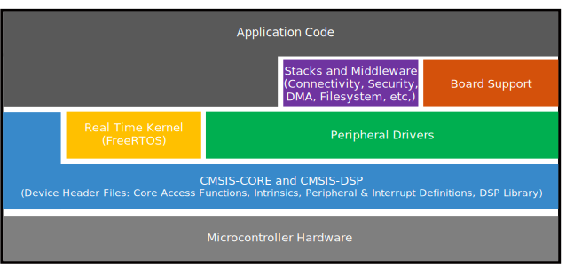

# Overview

The MCUXpresso Software Development Kit \(MCUXpresso SDK\) provides comprehensive software source code to be executed in the i.MX 8ULP M33 core. The MCUXpresso SDK includes a flexible set of peripheral drivers designed to speed up and simplify development of embedded applications. These drivers can be used standalone or collaboratively with the A35 cores running another Operating System \(such as Linux OS Kernel\). Along with the peripheral drivers, the MCUXpresso SDK provides an extensive and rich set of example applications covering everything from basic peripheral use case examples to demo applications. The MCUXpresso SDK also contains RTOS kernels, device stack, and various other middleware to support rapid development.

For supported toolchain versions, see the *MCUXpresso SDK Release Notes for EVK-MIMX8ULP* \(document MCUXSDKIMX8ULPRN\).

For the latest version of this and other MCUXpresso SDK documents, see the MCUXpresso SDK homepage [MCUXpresso-SDK: Software Development Kit for MCUXpresso.](http://www.nxp.com/products/software-and-tools/run-time-software/mcuxpresso-software-and-tools/mcuxpresso-software-development-kit-sdk:MCUXpresso-SDK)

|

|

