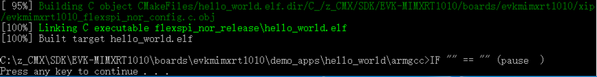

# Build an example application

To build an example application, follow these steps.

1.  Open a GCC Arm Embedded tool chain command window. To launch the window, from the Windows operating system **Start** menu, go to **Programs** \>**GNU Tools Arm Embedded <version\>** and select **GCC Command Prompt**.

    

2.  Change the directory to the example application project directory which has a path similar to the following:

    ```
    <install_dir>/boards/<board_name>/<example_type>/<application_name>/armgcc
    ```

    For this example, the exact path is:

    ```
    ><install_dir>/examples/evkmimxrt1010/demo_apps/hello_world/armgcc
    ```

    **Note:** To change directories, use the `cd` command.

3.  Type **build\_debug.bat** on the command line or double click on **build\_debug.bat** file in Windows Explorer to build it. The output is as shown in [Figure 2](build_an_example_application_002.md#HELLOWORLDBUILDSUCCESS9999).

    


**Parent topic:**[Run a demo using Arm® GCC](../topics/run_a_demo_using_arm__gcc.md)

