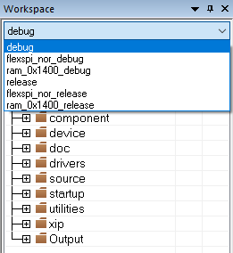
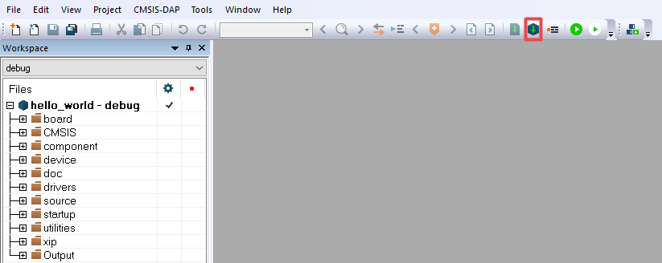

# Build an example application

The following steps guide you through opening the hello\_world example application. These steps may change slightly for other example applications as some of these applications may have additional layers of folders in their path.

1.  If not already done, open the desired demo application workspace. Most example application workspace files can be located using the following path:

    *<install\_dir\>/boards/<board\_name\>/<example\_type\>/<application\_name\>/iar*

    Using the MIMXRT1010-EVK hardware platform as an example, the hello\_world workspace is located in

    *<install\_dir\>/boards/evkmimxrt1010/demo\_apps/hello\_world/iar/hello\_world.eww*

2.  Select the desired build target from the drop-down.

    There are six project configurations \(build targets\) supported for most MCUXpresso SDK projects:

    -   Debug – Compiler optimization is set to low, and debug information is generated for the executable. The linker file is RAM linker, where text and data section is put in internal TCM.
    -   Release – Compiler optimization is set to high, and debug information is not generated. The linker file is RAM linker, where text and data section is put in internal TCM.
    -   ram\_0x1400\_debug - Project configuration is same as debug target. The linker file is RAM\_0x1400 linker, where text is put in ITCM with offset 0x1400 and data section is put in DTCM.
    -   ram\_0x1400\_release - Project configuration is same as release target. The linker file is RAM\_0x1400 linker, where text is put in ITCM with offset 0x1400 and data section is put in DTCM.
    -   flexspi\_nor\_debug - Project configuration is same as Debug target. The linker file is flexspi\_nor linker, where text is put in flash and data put in TCM.
    -   flexspi\_nor\_release - Project configuration is same as release target. The linker file is flexspi\_nor linker, where text is put in flash and data put in TCM.
    For this example, select the “hello\_world – Debug” target.

    

3.  To build the demo application, click the “Make” button, highlighted in red below.

    

4.  The build completes without errors.

**Parent topic:**[Run a demo application using IAR](../topics/run_a_demo_application_using_iar.md)

