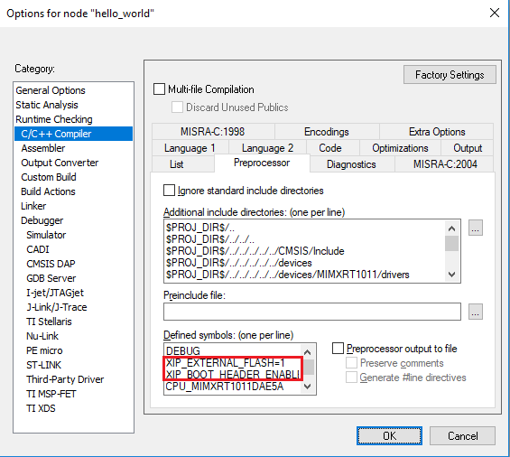
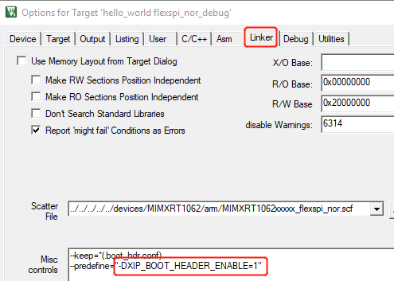
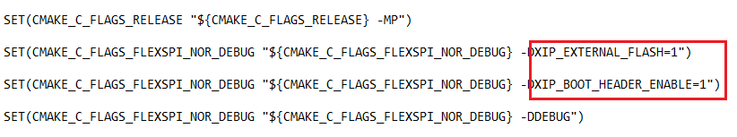
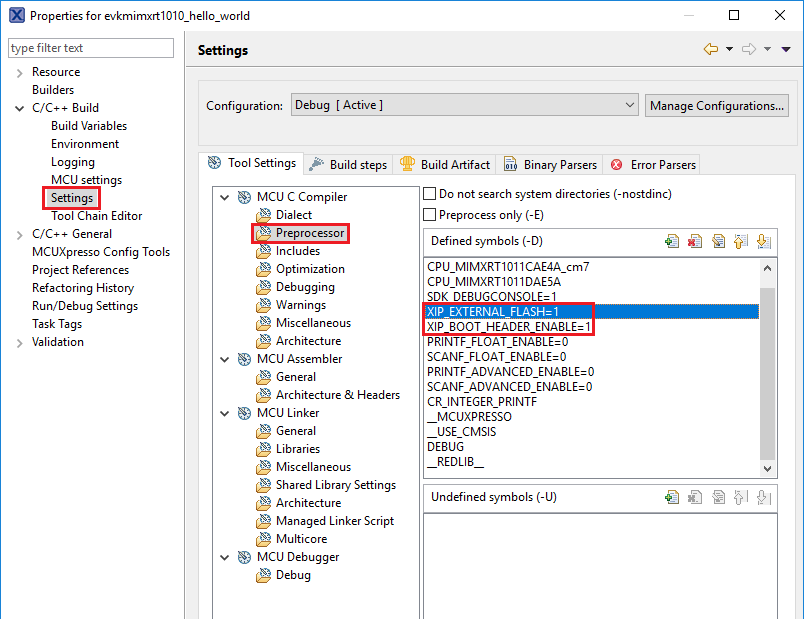

# How to add or remove boot header for XIP targets

The MCUXpresso SDK for i.MX RT1010 provides `flexspi_nor_debug` and `flexspi_nor_release` targets for each example and/or demo which supports XIP \(eXecute-In-Place\). These two targets add `XIP_BOOT_HEADER` to the image by default. Because of this, ROM can boot and run this image directly on external flash.

**Macros for the boot leader:**

-   The following two macros are added in `flexspi_nor` targets to support XIP, as described in [how\_to\_add\_or\_remove\_boot\_header\_for\_xip\_targets.md\#TABLE\_SUPPORTINGXIP](how_to_add_or_remove_boot_header_for_xip_targets.md#TABLE_SUPPORTINGXIP).

    ^

    |**XIP\_EXTERNAL\_FLASH**|1: Exclude the code which will change the clock of flexspi.|
    |0: Make no changes.|
    |**XIP\_BOOT\_HEADER\_ENABLE**|1: Add FLEXSPI configuration block, image vector table, and boot data to the image by default.|
    |0: Add nothing to the image by default.|

-   [how\_to\_add\_or\_remove\_boot\_header\_for\_xip\_targets.md\#TABLE\_EFFECTSONBUILTIMAGE](how_to_add_or_remove_boot_header_for_xip_targets.md#TABLE_EFFECTSONBUILTIMAGE) shows the different effect on the built image with a different combination of these macros:

    ^

    |**XIP\_EXTERNAL\_FLASH=1**|**XIP\_BOOT\_HEADER\_ENABLE=1**|Can be programed to external flash by IDE and can run after POR reset if external flash is the boot source.|
    |**XIP\_BOOT\_HEADER\_ENABLE=0**|Can **NOT** run after POR reset if it is programed by IDE even if external flash is the boot source.|
    |**XIP\_EXTERNAL\_FLASH=0**|This image can **NOT** do XIP because when this macro is set to **1**, it will exclude the code which will change the clock of flexspi.|

**Where to change the macros for each toolchain in MCUXpresso SDK?**

Take `hello_world` as an example:

-   **IAR**

    

-   **MDK**

    

    

-   **ARMGCC**

    Change the configuration in CMakeLists.txt.

    

-   **MCUX**

    

