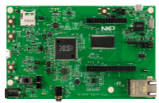

.. _evkmimxrt1024:

MIMXRT1024-EVK
####################

Overview
********

The NXP MIMXRT1024-EVK is a development board for the i.MX MIMXRT1024 500 MHz 32-bit ARM Cortex-M7 MCUs. The i.MX RT1024 EVK is a 2-layer low-cost through-hole USB-powered PCB. At its heart lies the i.MX RT1024 crossover MCU in LQFP144 package, featuring NXPs advanced implementation of the Arm Cortex-M7 core. This core operates at speeds up to 500 MHz to provide high CPU performance and excellent real-time response.

MCU device and part on board is shown below:

 - Device: MIMXRT1024
 - PartNumber: MIMXRT1024DAG5A

