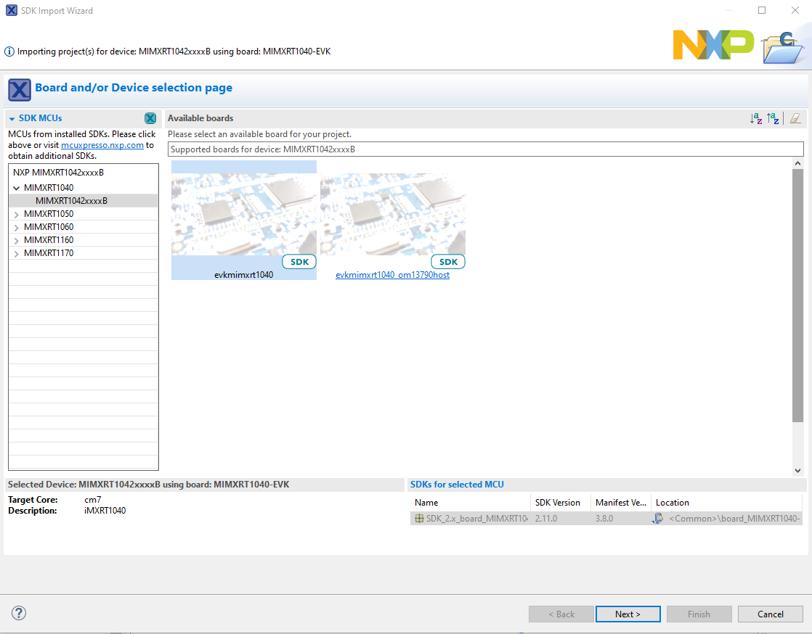
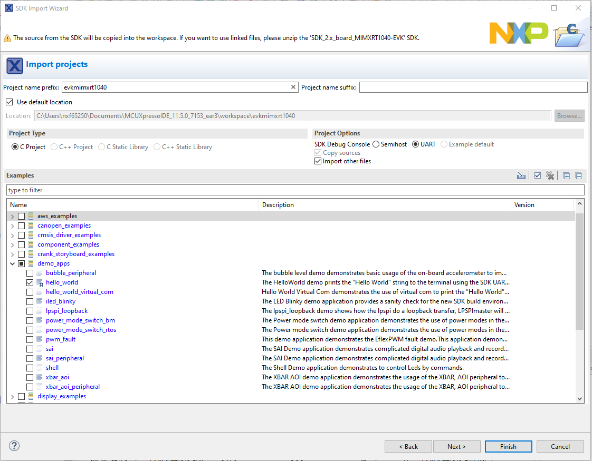
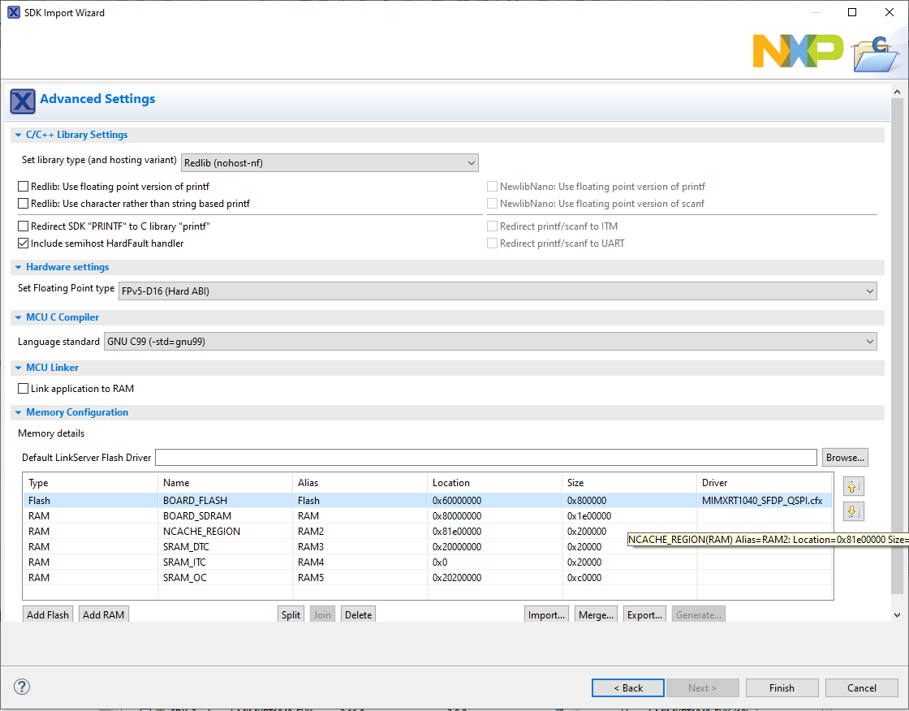
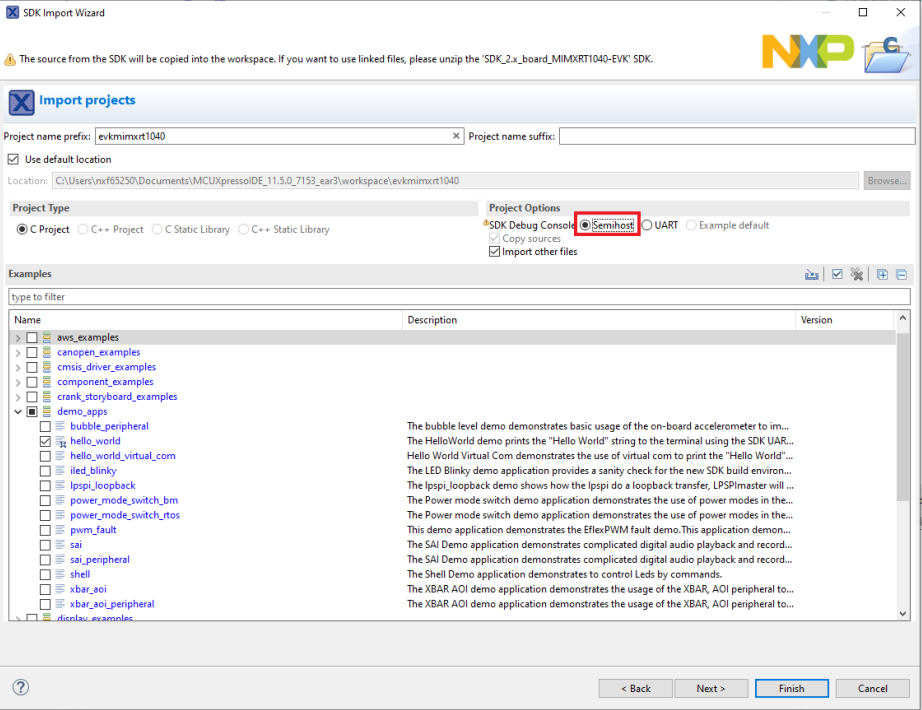
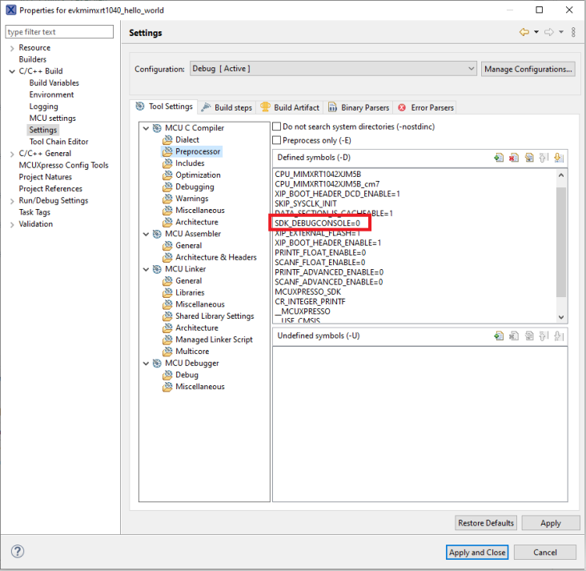
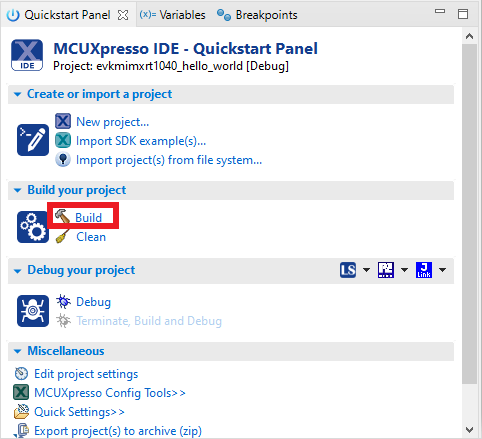

# Build an example application

To build an example application, follow these steps.

1.  Drag and drop the SDK zip file into the **Installed SDKs** view to install the MCUXpresso SDK. In the window that appears, click **OK** and wait until the import has finished.

    |

|

2.  On the **Quickstart Panel**, click **Import SDK example\(s\)…**, as shown in [Figure 2](build_an_example_application_002.md#FIG_IMPORTANSDKEXAMPLE).

    |

|

3.  In the window that appears, expand the **MIMXRT1040** folder and select **MIMXRT1042xxxxx**. Then, select **evkmimxrt1040** and click **Next**, as shown in [Figure 3](build_an_example_application_002.md#FIG_SELECTBOARD).

    |

|

4.  Expand the `demo_apps` folder, select `hello_world`, and then click **Next**.

    |

|

5.  Ensure the option **Redlib: Use floating point version of printf** is selected if the cases print floating point numbers on the terminal \(for demo applications such as `dac32_adc12`, `dac_adc`, `dac_cadc`, `ecompass`, `sai`, `coremark`, `mbedtls_benchmark`, `wolfssl_benchmark`, and for `mmcau_examples` such as `mmcau_api`\). Otherwise, there is no need to select it. Click **Finish**.

    |

|

    **Note:** If you want to use semihost to print log, first select the **Semihost** button when importing projects, as shown in [Figure 6](build_an_example_application_002.md#FIG_SEMIHOST).

    |

|

    |

|

6.  On the **Quickstart** panel, click **build `evkmimxrt1040_demo_apps_hello_world [Debug]`**, as shown in [Figure 8](build_an_example_application_002.md#FIG_BUILDHELLWORLD).

    |

|

**Parent topic:**[Run a demo using MCUXpresso IDE](../topics/run_a_demo_using_mcuxpresso_ide.md)

