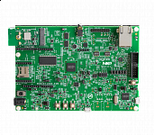

.. _evkmimxrt1040:

MIMXRT1040-EVK
####################

Overview
********

MIMXRT1040-EVK development kit provides the ideal platform for evaluation of and development with the 600MHz i.MX RT1040 Crossover MCU based on the Arm Cortex-M7 architecture. The board includes a high-performance onboard debug probe, audio subsystem, accelerometer, networking and USB plus expansion options for displays and other add-on boards. The Kit includes a Murata Wifi module based on NXP's IW416 2.4/5 GHz Dual-Band 1x1 Wi-Fi 4 (802.11n) + Bluetooth 5.2 Solution.

.

The MIMXRT1040-EVK is designed to be a reference for low cost board designs, utilizing a 2 layer PCB design. A design files are available to provide a starting point for your design.

MCU device and part on board is shown below:

 - Device: MIMXRT1042
 - PartNumber: MIMXRT1042XJM5B

Getting Started
****************
.. toctree::
   :maxdepth: 1
   :caption: Getting Started with MCUXpresso SDK for MIMXRT1040-EVK

   gettingStarted/gsindex.md
