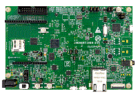

.. _evkmimxrt1060:

EVK-MIMXRT1060
####################

Overview
********

The NXP MIMXRT1060-EVK is a development board for the i.MX MIMXRT1062 and MIMXRT1061 600 MHz 32-bit ARM Cortex-M7 MCUs.

MCU device and part on board is shown below:

 - Device: MIMXRT1062
 - PartNumber: MIMXRT1062DVL6A

