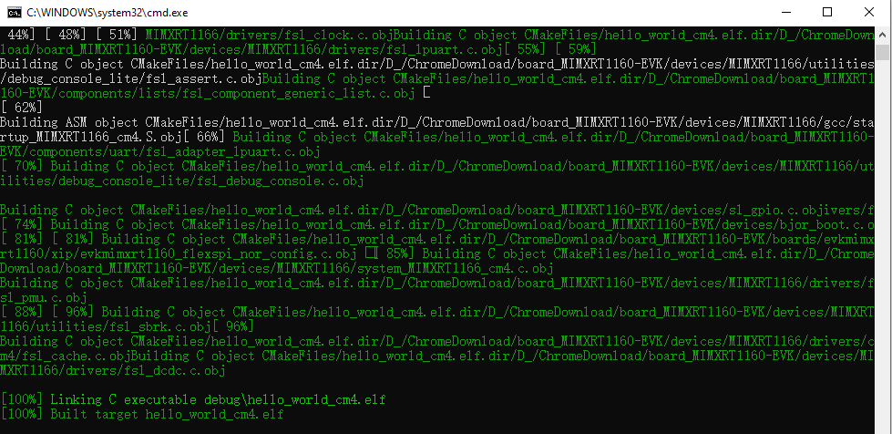
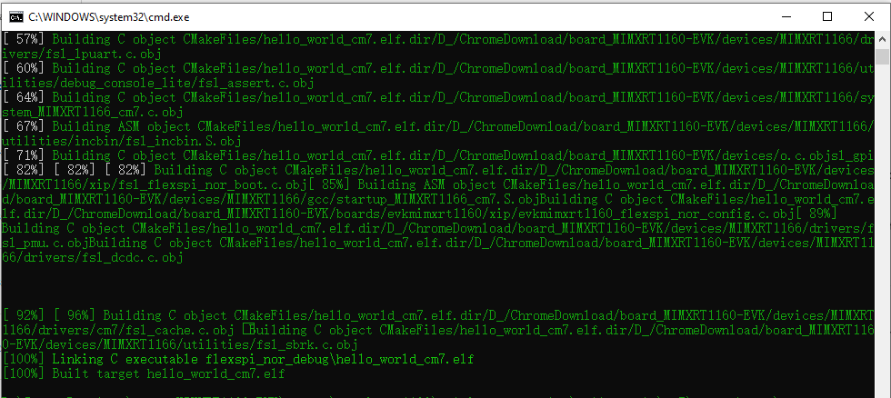

# Build a multicore example application

This section describes the steps to build and run a dual-core application. The demo application build scripts are located in this folder:

*<install\_dir\>/boards/evkmimxrt1160/multicore\_examples/<application\_name\>/<core\_type\>/armgcc*

Begin with a simple dual-core version of the Hello World application. The multicore Hello World GCC build scripts are located in this folder:

*<install\_dir\>/boards/evkmimxrt1160/multicore\_examples/hello\_world/cm4/armgcc/build\_debug.bat*

*<install\_dir\>/boards/evkmimxrt1160/multicore\_examples/hello\_world/cm7/armgcc/build\_flexspi\_nor\_debug.bat*

Build both applications separately following steps for single core examples as described in [Build an example application](build_an_example_application.md).

**Parent topic:**[Run a demo using Arm® GCC](../topics/run_a_demo_using_arm_gcc.md)

