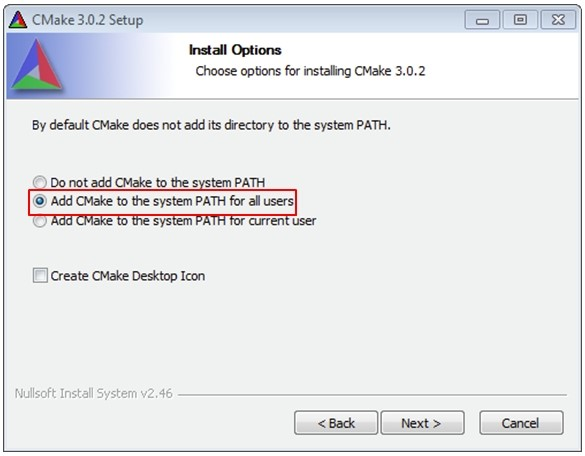

# Install CMake

1.  Download CMake 3.0.x from [CMAKE](http://www.cmake.org/cmake/resources/software.html).
2.  Install CMake, ensuring that the option **Add CMake to system PATH**is selected when installing. The user chooses to select whether it is installed into the PATH for all users or just the current user. In this example, it is installed for all users.

    

3.  Follow the remaining instructions of the installer.
4.  You may need to reboot your system for the PATH changes to take effect.
5.  Make sure sh.exe is not in the Environment Variable PATH. This is a limitation of `mingw32-make`.

**Parent topic:**[Set up toolchain](../topics/set_up_toolchain.md)

