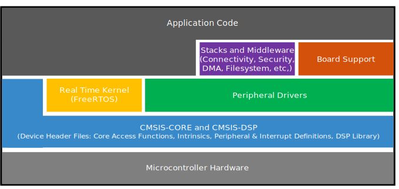

# Overview

The MCUXpresso Software Development Kit \(SDK\) provides comprehensive software support for Kinetis and LPC Microcontrollers. The MCUXpresso SDK includes a flexible set of peripheral drivers designed to speed up and simplify development of embedded applications. Along with the peripheral drivers, the MCUXpresso SDK provides an extensive and rich set of example applications covering everything from basic peripheral use case examples to full demo applications. The MCUXpresso SDK contains FreeRTOS and various other middleware to support rapid development.

For supported toolchain versions, see *MCUXpresso SDK Release Notes for MIMXRT1160-EVK* \(document MCUXSDKMIMXRT116XRN\).

For more details about MCUXpresso SDK, see [MCUXpresso Software Development Kit \(SDK\)](http://www.nxp.com/products/software-and-tools/run-time-software/mcuxpresso-software-and-tools/mcuxpresso-software-development-kit-sdk:MCUXpresso-SDK).

