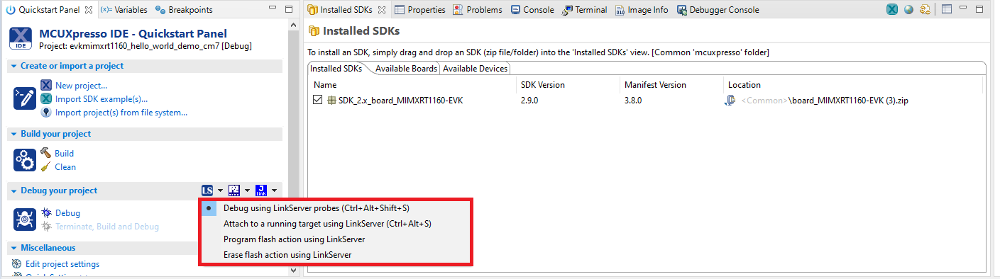
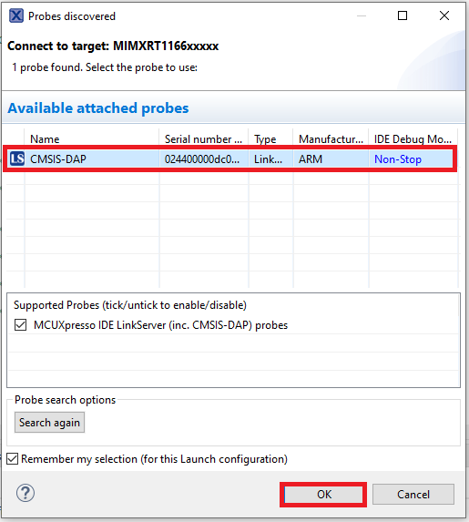
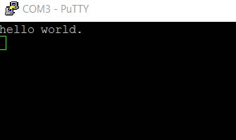

# Run an example application

To download and run the application, perform the following steps:

1.  See [default\_debug\_interfaces.md\#TABLE\_HWPLATFORMS](default_debug_interfaces.md#TABLE_HWPLATFORMS) to determine the debug interface that comes loaded on your specific hardware platform.

    -   If using J-Link with either a standalone debug pod or OpenSDA, install the J-Link software \(drivers and utilities\) from [SEGGER](https://www.segger.com/downloads/jlink/).
    -   For boards with the OSJTAG interface, install the driver from [KEIL](https://www.keil.com/).
2.  Connect the development platform to your PC via a USB cable.
3.  Open the terminal application on the PC, such as PuTTY or TeraTerm, and connect to the debug serial port number. To determine the COM port number, see [How to determine COM port](how_to_determine_com_port.md). Configure the terminal with these settings:

    1.  115200 or 9600 baud rate, depending on your board \(reference `BOARD_DEBUG_UART_BAUDRATE` variable in the *board.h* file\)
    2.  No parity
    3.  8 data bits
    4.  1 stop bit
     configurations")

4.  On the **Quickstart Panel**, click **Debug 'evkmimxrt1160\_demo\_apps\_hello\_world’ \[Debug\]**.

    

5.  The first time you debug a project, the **Debug Emulator Selection** dialog is displayed, showing all supported probes that are attached to your computer. Select the probe through which you want to debug and click **OK**. \(For any future debug sessions, the stored probe selection is automatically used, unless the probe cannot be found.\)

    

6.  The application is downloaded to the target and automatically runs to `main()`.

     when running debugging")

7.  Start the application by clicking **Resume**.

    

The `hello_world` application is now running and a banner is displayed on the terminal. If this is not the case, check your terminal settings and connections.

**Parent topic:**[Run a demo using MCUXpresso IDE](../topics/run_a_demo_using_mcuxpresso_ide.md)

