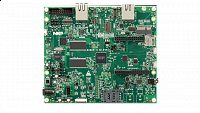

.. _evkmimxrt1170:

MIMXRT1170-EVK
####################

Overview
********

The i.MX RT1170 EVK provides a high-performance solution in a highly integrated board. It consists of a 6-layer PCB with through hole design for better EMC performance at a low cost, and it includes key components and interfaces.

MCU device and part on board is shown below:

 - Device: MIMXRT1176
 - PartNumber: MIMXRT1176DVMAA

