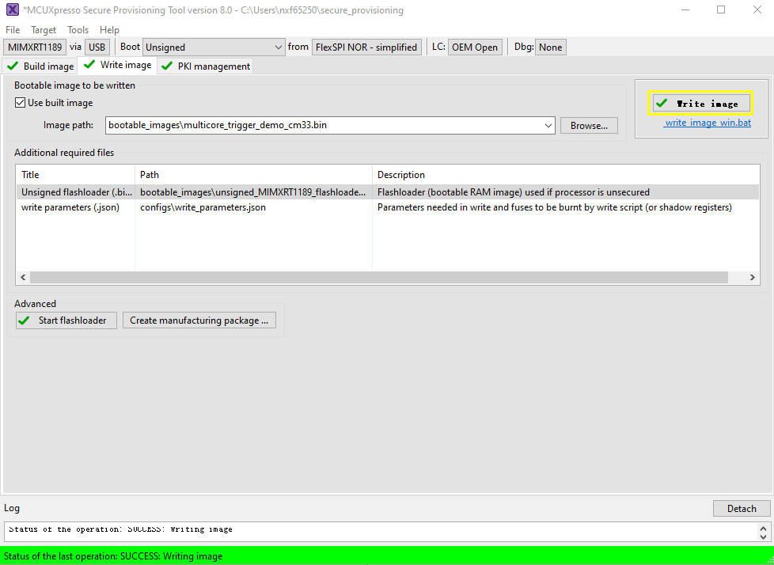

# CM7 XIP image runs from external FLASH, and `multicore_trigger` CM33 image runs from internal RAM {#topic_cnd_4lx_g1c}

Perform the following steps:

1.  Prepare the `multicore_trigger_demo_cm33` ram image \(`debug` or `release` targets\) and specify it in `Source executable image`.
2.  Specify the XMCD file if necessary \(see [Use SPT tool and multicore\_trigger image to kick off cm7 binary image](use_SPT_tool_and_multicore_trigger_image.md)\).
3.  Use `Additional images` to specify CM7 application image running from flash memory. See [Table 1](#table_para) for how to fill in the necessary information for this additional image.

    |Parameter|Explanation|
    |---------|-----------|
    |Image offset|`0xA000`

 The offset in bytes from start of the current container header to beginning of the image. In our case, the CM7 image is flashed to `0x2800_B000`. The container header is put to `0x2800_1000` and the yield offset = `0xA000`.

|
    |Load address|`0x2800B000`

 The destination address of the CM7 image. ROM copies the image to load address, if it is not within flash address space. In our case, copy does not happen.

|
    |Entry point|`0x2800B000`

 The start address of CM7 image vector table from CM7 core address space.

|
    |Core ID|cortex-m7|
    |Image type|Executable|
    |Encrypted|No|

    

4.  \(Optional\) ELE firmware.

    It is needed for a certain application image, which need special ELE FW service. For most SDK demos, simply leaves it empty.

    

    

    

After a successful write, change the `SW5[1..4]` to QSPI boot mode `0100` and reset the board. You can observe that the image is running from POR boot.

**Parent topic:**[Use SPT tool and multicore\_trigger image to kick off cm7 binary image](../topics/use_SPT_tool_and_multicore_trigger_image.md)

