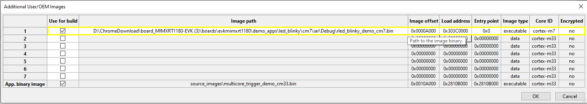
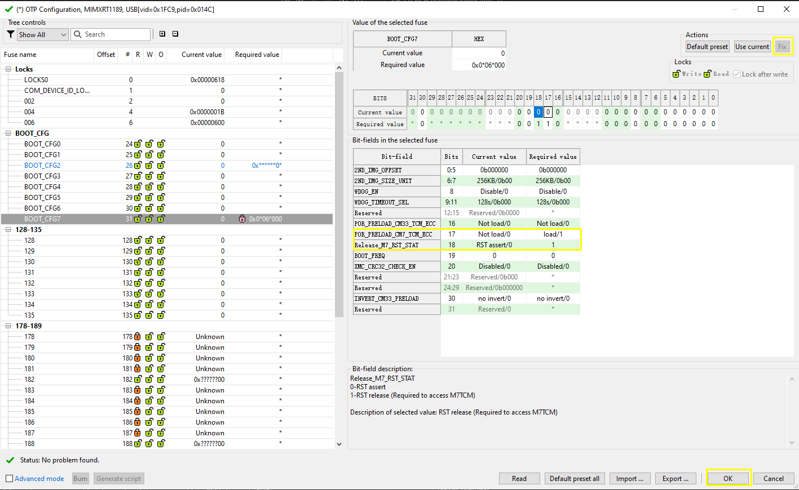
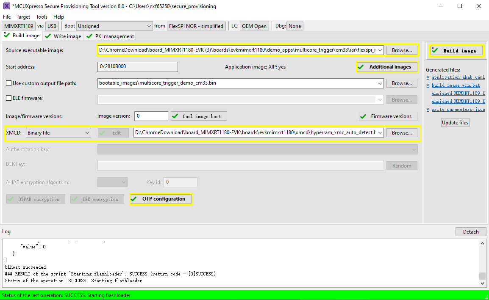
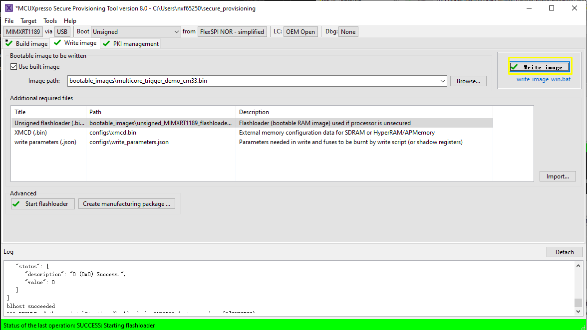

# CM7 binary image runs from internal TCM, and `multicore_trigger` CM33 image runs from external FLASH {#topic_wbc_5lx_g1c}

**Note:** Be very careful that this scenario requires fuse manipulation, which is not revertible.

1.  Prepare the `multicore_trigger_demo_cm33` flash target image \(`flexspi_nor_debug` or `flexspi_nor_release`\) and specify it in `Source executable image`.
2.  Use `Additional images` to specify CM7 application image running from ITCM memory. See [Table 1](#table_para) for how to fill in necessary information for this additional image.

<table id="table_para"><thead><tr><th>

Parameter

</th><th>

Explanation

</th></tr></thead><tbody><tr><td>

Image offset

</td><td>

`0xA000`

 The flash allocation is the same as previous scenario.

</td></tr><tr><td>

Load address

</td><td>

`0x303C0000`

 This is the secured alias of CM7 ITCM in CM33/ROM memory space. ROM will copy image to this address.

</td></tr><tr><td>

Entry point

</td><td>

`0x0`

 The start address of vector table from CM7 core address space.

</td></tr><tr><td>

Core ID

</td><td>

`cortex-m7`

</td></tr><tr><td>

Image type

</td><td>

Executable

</td></tr><tr><td>

Encrypted

</td><td>

No

</td></tr></tbody>
</table>    

3.  For ROM to successful copy image from flash to CM7 TCM. CM7 TCM ECC should be pre-configured. To archive this, a Fuse need to be set. Click OTP configuration, set `POR_PRELOAD_CM7_TCM_ECC` and `RELEASE_M7_RST_STAT` fuses in `BOOT_CFG7` to 1.

    **Note:** Be very careful that any setting on OTP won't be reverted once set. There is possibility that the chip get bricked if you are fusing the wrong fuse word. Only do this if you really need to try this boot scenario.

    

4.  \(Optional\) ELE firmware.

    It is needed for a certain application image which needs a special ELE FW service. For most SDK demos, simply leave it empty.

    

    

    


After a successful write, change the `SW5[1..4]` to QSPI boot mode `0100` and reset the board. You can observe that the image is running from the POR boot.

**Note:**

1.  The new image constructed under **Build images** is still not a complete image, and the Memory Configuration Block is missing. When writing image, SPT downloads the contents of the Memory Configuration Block to FLASH.
2.  When CM33 + CM7 image runs with the following target combination, it is required to set `CM33_SET_TRDC` to 1U in `multicore_trigger` demo, also requires to set `CM33_SET_TRDC` to 1U in CM7 demo if it exists.

    ```
    - CM33 flexspi + CM7 flexspi, flexspi means flexspi_nor_debug/release, flexspi_nor_sdram_debug/release, flexspi_nor_hyperram_debug/release
    - CM33 HYPERRAM + CM7 HYPERRAM, HYPERRAM means hyperram_txt_debug/release.
    ```

3.  Only those `cm7` projects whose linkages are similar with `hello_world_demo_cm7`, support POR run via `multicore_trigger_cm33`.

**Parent topic:**[Use SPT tool and multicore\_trigger image to kick off cm7 binary image](../topics/use_SPT_tool_and_multicore_trigger_image.md)

