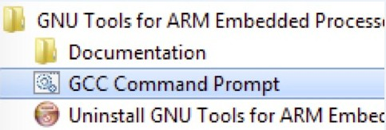
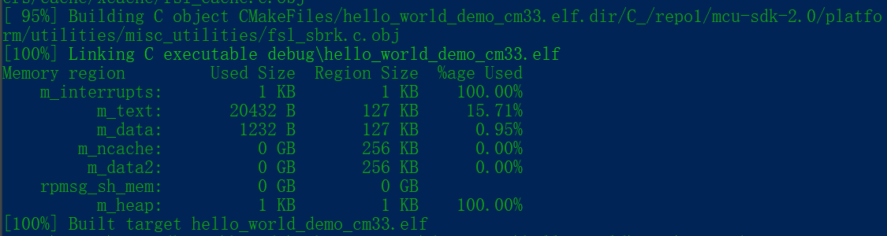

# Build an example application {#GUID-D13AD548-C3AF-4CB2-8338-870423399C63}

To build an example application, perform the following steps.

1.  Open a GCC Arm Embedded tool chain command window. To launch the window, from the Windows operating system **Start** menu, go to **Programs** &gt; **GNU Tools ARM Embedded &lt;version&gt;** and select **GCC Command Prompt**.

    

2.  Change the directory to the example application project directory which has a path similar to the following:

    *&lt;install\_dir&gt;/boards/&lt;board\_name&gt;/&lt;example\_type&gt;/&lt;core\_type&gt;/&lt;application\_name&gt;/armgcc*

    For this example, the exact path is:

    *&lt;install\_dir&gt;/examples/evkmimxrt1180/demo\_apps/hello\_world/cm33/armgcc*

3.  Type **build\_debug.bat**on the command line or double click on **build\_debug.bat**file in Windows Explorer to build it. The output is as shown in [Figure 2](#FIG_HELLOWORLDSUCCESS).

    

**Parent topic:**[Run a demo using Arm GCC](../topics/run_a_demo_using_arm_gcc.md)

